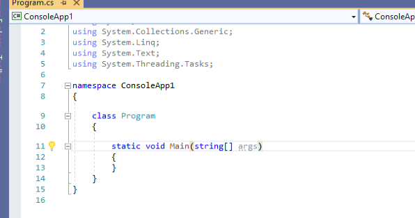
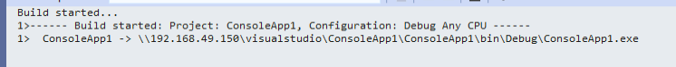
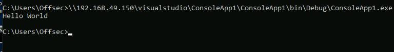

## Introduction

There are two primary integrated development environments (IDE) focused on developing and compiling C# applications: **Mono** and **Microsoft Visual Studio**.

We start by creating a new project in Visual Studio:



We will be populating this pre-made C# console application to display "Hello World"
We add a line of code inside the _Main_ method to create the application. We'll be using the Console.WriteLine method to print some text to the console when the application is executed.
The line of code is:
```C#
Console.WriteLine("Hello World");
```

We will now compile our very basic application.
note: we will switch to release mode from debugging mode to remove any debugging information that might trigger an AV.

We can now compile our application by navigating to _Build_ > _Build Solution_ or _Build_ > _Build ConsoleApp1_



Our compilation was complete and has been stored in the given path.

Going to cmd on windows, and executing the binary we get a command prompt displaying "Hello World", meaning that we've created our first binary:



