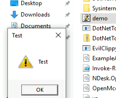
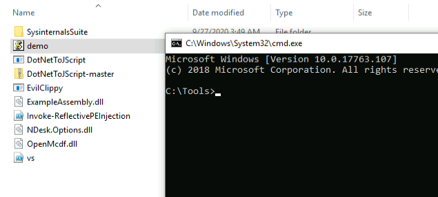

## C# Assembly from Jscript
We will get the DotNet to Jscript compiler from tyranid's github [repo](https://github.com/tyranid/DotNetToJScript)

Once we have this installed, we'll open the DotNetToJSCript.sln project in Visual Studio and start by compiling with the Release mode.

Once the build has been completed, we need to move a few files for the DotNetToJScript to work correctly.

We move the DotNetToJscript.exe, NDesk.Options.dll and  ExampleAssembly.dll to one folder.

We then run the following command:
```cmd
DotNetToJScript.exe ExampleAssembly.dll --lang=Jscript --ver=v4 -o demo.js
```

1. We specify the executable to run 
2. We give the input file i.e. ExampleAssembly.dll.
3. We give the --lang parameter to specify the script language to use (Jscript)
4. We also give the version of the .NET framework with --ver.
5. Finally, we give the ouput file to create with the -o flag.

Our file is created and prompts us with a test message box when double clicked.




## Exercise
We need to make our TestClass.cs file launch a command prompt instead of opening a MessageBox.

This is very simple as we have the [System.Diagnostics.Process](https://docs.microsoft.com/en-us/dotnet/api/system.diagnostics.process.start?view=net-6.0) class with us.
The _Start_ method allows us to start a process, we will change the message box line to the following:
```c#
System.Diagnostics.Process.Start(@"C:\Windows\System32\cmd.exe");
```

Build the solution, and use the DotNetToJScript as before to build the binary.



Double clicking the jscript file, a cmd prompt is launched.
