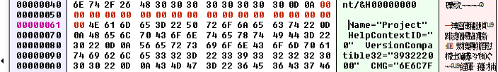
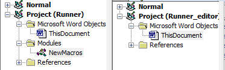
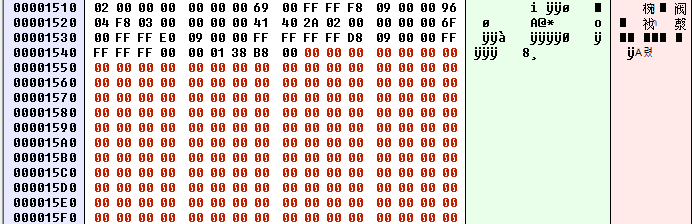

## New Extensions
The Microsoft Office file formats used in documents with .doc and .xls extensions rely on the very old and partially-documented proprietary _Compound File Binary Format_, which can combine multiple files into a single disk file.
On the other hand, more modern Microsoft Office file extensions, like .docm and .xlsm, describe an updated and more open file format that is not dissimilar to a .zip file.

There are no official tools for unwrapping .doc files, so we'll turn to the third party _FlexHEX_ application.
Opening the file in flex hex, we find:
The binary content contains the ASCII line "Module=NewMacros", which is what the GUI editor uses to link the displayed macros.
 To remove this link in the graphical editor, we can simply remove the line by replacing it with null bytes. This is done by highlighting the ASCII string and navigating to _Edit_ -> _Insert Zero Block_, which opens a new window.
 We can save the change by clicking _OK_.
 

 We see the result in the office vba editor:
 

 This helps us to hide our code, however, it does not help our case to evade antivirus, as AntiScan.ME still gives the same result.

 ## VBA stomping
We now improvise on this.
The key concept here is _PerformanceCache_, which is a structure present in both _VBA_PROJECT and NewMacros
Inspecting the documentation reveals that this signifies a cached and compiled version of the VBA textual code, known as _P-code_.
The P-code is a compiled version of the VBA textual code for the specific version of
Microsoft Office and VBA it was created on.

Tf a Microsoft Word document is opened on a different computer that uses the same version and edition of Microsoft Word, the cached pre-compiled P-code is executed, avoiding the translation of the textual VBA code by the VBA interpreter.
Alternatively, If the document is opened on a different version or edition of Microsoft Word, the P-code is ignored and the textual version of the VBA is used instead.

Using FlexHEX, we can view the P-code inside the NewMacros file.

The concept of removing the VBA source code has been termed _VBA Stomping_.
We need to mark the bytes that start with the ASCII characters "Attribute VB_Name" and select all the remaining bytes.
With the VBA source code selected, we'll navigate to _Edit_ > _Insert Zero Block_ and accept the size of modifications.

If we open the VBA editor, we'll find that the NewMacro container is completely empty.
However, when we accept the security warning and let the VBA macro execute, we notice two things:
1.  We obtain a reverse Meterpreter shell
2. Microsoft Word decompiled the P-code and wrote it back into the editor while executing it.

Scanning our file in AntiScan.Me, we get a lower-than-before detection rate of only 4/26 antivirus products.

