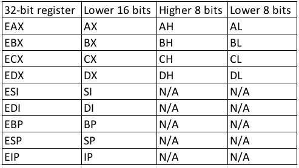
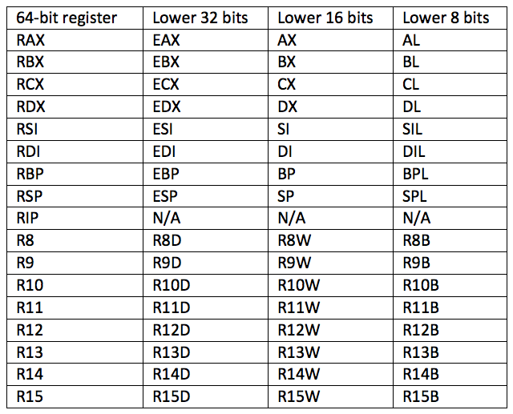

## The Need
We purposely downloaded and executed the code directly in memory without giving the antivirus a chance to scan it.
However, Microsoft addressed this gap with the _Antimalware Scan Interface_ [(AMSI)](https://docs.microsoft.com/en-us/windows/win32/amsi/antimalware-scan-interface-portal) ,introduced in Windows 10.
AMSI is essentially a set of APIs that allow antivirus products to scan PowerShell commands and scripts when they are executed, even if they are never written to disk.

Many antivirus products (including Microsoft's own _Windows Defender Antivirus_) have begun to rely on AMSI to detect more advanced malicious activity.

We'll explore the impact of Windows Defender's implementation of AMSI on PowerShell and Jscript.
we'll begin with an overview of assembly and then discuss the process of viewing code execution through the [Windows Debugger](https://docs.microsoft.com/en-us/windows-hardware/drivers/debugger/debugger-download-tools).

## Intel Architecture
The two primary assembly syntaxes, Intel and AT&T, are predominantly used by Windows and Linux, respectively.
The 64-bit architecture is an extension of the 32-bit architecture and as such, there are many similarities.
At the assembly level, both make heavy use of data areas like the [stack](https://en.wikipedia.org/wiki/Stack-based_memory_allocation) or the [heap](https://en.wikipedia.org/wiki/C_dynamic_memory_allocation#Heap-based) and both use CPU registers.

The **stack** typically stores the contentis stored either in memory or in a CPU register. of (higher-language) variables that are of static size and limited scope. 
whereas, the **heap** is used for dynamic memory allocation and long-runtime persistent memory.
All the data in assembler, is stored either in memory or in a CPU register.

**32 bit registers**
In a 32-bit environment, the CPU maintains and uses a series of nine 32-bit registers:

In 64-bit environments, the 32-bit registers are extended and include new registers:

**Imporatant ones**
The most important registers for us to understand in our current context are the 32-bit _EIP_ and _ESP_ registers and their 64-bit extended counterparts _RIP_ and _RSP_.
EIP/RIP contains the address of the assembly instruction to be executed by the CPU and the memory address of the top of the stack is in ESP/RSP.

There are 2 types of calls in assembly execution flow:
1. Function calls
2. Conditional branches

**Function calls**
Function calls work as follows:
1. The [_call_](https://www.felixcloutier.com/x86/call) assembly instruction transfers program execution to the address of the function.
2. It then places the address to execute once the function is complete on the top of the stack where ESP (or RSP) is pointing. 
3. Once the function is complete, the [_ret_](https://www.felixcloutier.com/x86/ret) instruction is executed, which fetches the return address from the stack and restores it to EIP/RIP.
4. When a function requires arguments, a _calling convention_ specifies how, exactly, arguments are passed to that function.
			- On a 32-bit architecture, the [_stdcall_](https://docs.microsoft.com/en-us/cpp/cpp/stdcall?view=msvc-170&viewFallbackFrom=vs-2019) calling convention reads all arguments from the stack.
			- However, the 64-bit [_fastcall_](https://docs.microsoft.com/en-us/cpp/cpp/fastcall?view=msvc-170&viewFallbackFrom=vs-2019) calling convention expects the first four arguments in _RCX_, _RDX_, _R8_, and _R9_ (in that order) and the remaining arguments on the stack.

**Conditional Branching**
Conditional branching is the second aspect of assembly execution flow that goes as follows:
1. In assembly, conditional branching (similar to the _if_ and _else_ statements in higher-level languages) is implemented through a comparison and a jump instruction.
2. we might use a [_cmp_](https://www.felixcloutier.com/x86/cmp) or [_test_](https://www.felixcloutier.com/x86/test) instruction, and based on the result of this comparison, we could execute a conditional jump [instruction]() to another section of code.

