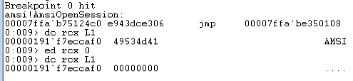

## Initial Bypass
To bypass AMSI, we'll take a much simpler approach and attempt to halt AMSI without crashing PowerShell.

**AsmiInitalize fault**
The _AmsiInitialize_ API has not been documented by Microsoft.
Undocumented functions, structures, and objects are often prone to error, and provide a golden opportunity for security researchers and exploit developers.

If we can force some sort of error in this context structure, we may discover a way to crash or bypass AMSI without impacting PowerShell.

We will start by using Frida to locate its address in memory and then use WinDbg to inspect its content
we'll enter another "test" string to obtain the memory address of the context structure.
_AmsiContext_ is created when AMSI is initialized so its memory address does not change between scans, allowing us to inspect it easily with WinDbg, which means that the memory addresss in the amsiContext field will be constant b/w scans.


Next,we'll open WinDbg, attach to the PowerShell process, and dump the memory contents of the context structure
We observe that the first four bytes equate to the ASCII representation of "AMSI".


We'll use the unassemble command in WinDbg along with the _AmsiOpenSession_ function from the AMSI module.


The fourth line of assembly code is interesting as it compares the contents of a memory location to the four static bytes we just found inside the context structure.

If the header bytes are not equal to this static DWORD, the conditional jump is triggered and execution goes to offset 0x4B inside the function.
Using windbg we can display instructions at that address:


The conditional jump leads directly to an exit of the function where the static value 0x80070057 is placed in the EAX register.
On both the 32-bit and 64-bit architectures, the function return values are returned through the EAX/RAX register.
This error occurs if the context structure has been corrupted. If the first four bytes of _amsiContext_ do not match the header values, _AmsiOpenSession_ will return an error.

To see what happens if the error occurs, we'll place a breakpoint on _AmsiOpenSession_ and trigger it by entering a PowerShell command.
Once the breakpoint has been triggered, we'll use ed to modify the first four bytes of the context structure, and let execution continue.



After overwriting the AMSI header value, we'll continue execution, which generates exceptions.
_AmsiOpenSession()_ has exited. This indicates that AMSI has been shut down.
If we now enter a malicious command,  none of the hooked AMSI APIs are called and our command is not flagged.


## Powershell Reflection Bypass
Although this method is effective, it relies on manual intervention with WinDbg. We will now, implement this bypass directly from PowerShell with reflection.

PowerShell stores information about AMSI in managed code inside the _System.Management.Automation.AmsiUtils_ class, which we can enumerate and interact with through reflection.
Sadly, Windows Defender and AMSI will block us from obtaining a reference to the class due to the malicious 'AmsiUtils' string. Instead, we can locate the class dynamically.
We will use the following code:
```Powershell
$a=[Ref].Assembly.GetTypes();Foreach($b in $a) {if ($b.Name -like "*iUtils") {$c=$b}};$d=$c.GetFields('NonPublic,Static');Foreach($e in $d) {if ($e.Name -like "*Context") {$f=$e}};$g=$f.GetValue($null);[IntPtr]$ptr=$g;[Int32[]]$buf = @(0);[System.Runtime.InteropServices.Marshal]::Copy($buf, 0, $ptr, 1)
```
This code will dynamically locate the class, enumerates all objects and variables in the class, loops through the objects to get "amsiContext" field,  the output contains a large integer who's hex value is the memory address of the AMSI header talked about previously.
Finally, the code changes the value to 0 to force an error.

The code lets us bypass amsi.
