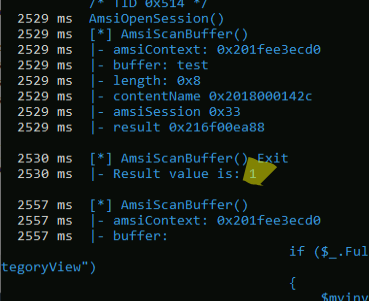
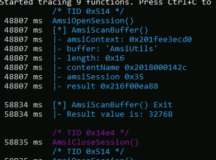

## Why Frida Though?
We could use WinDbg breakpoints to trace the calls to the exported AMSI calls, but the [_Frida_](https://frida.re/) dynamic instrumentation framework offers a more flexible approach.
Frida allows us to hook Win32 APIs through a Python backend while using JavaScript to display and interpret arguments and return values.

We'll use Frida in a powershell session with the following command:
```Powershell
frida-trace -p 1584 -x amsi.dll -i Amsi*
```

- Frida-trace - Invokes Frida
- p flag - process ID
- x flag - DLL to be traced
- i flag - APIs to be traced(* for a wildcard)

When we start a Frida tracing session, handler files are created for each hooked API. For _AmsiScanBuffer_, the handler file is located at
C:\\Users\\Offsec\\__handlers__\\amsi.dll\\AmsiScanBuffer.js

To better understand the ouput, we update the _OnEnter_ function as follows:
```JS
onEnter: function (log, args, state) {
  log('[*] AmsiScanBuffer()');
  log('|- amsiContext: ' + args[0]);
  log('|- buffer: ' + Memory.readUtf16String(args[1]));
  log('|- length: ' + args[2]);
  log('|- contentName ' + args[3]);
  log('|- amsiSession ' + args[4]);
  log('|- result ' + args[5] + "\n");
  this.resultPointer = args[5];
},
```
To provide visibility into the arguments provided to AmsiScanBuffer, we add log statements for each entry in the args array.
NOTE:
- The [_readUtf16String_](https://frida.re/docs/javascript-api/#memory) method is used with the second argument (the buffer to be scanned) to print out its content as a Unicode string.
- The last argument is the storage address of the antivirus scan result. This address is stored in the _resultPointer_ JavaScript variable through the [_this_](https://developer.mozilla.org/en-US/docs/Web/JavaScript/Reference/Operators/this) keyword for later access.

we also hook the _AmsiScanBuffer_ function exit through _onLeave_ in the JavaScript handler code, to store the scan result pointer to the point where AMSI API exits and the result is printed to console:
```JS
onLeave: function (log, retval, state) {
  log('[*] AmsiScanBuffer() Exit');
  resultPointer = this.resultPointer;
  log('|- Result value is: ' + Memory.readUShort(resultPointer) + "\n");
}
```
we've used the _readUshort_ method to read the result value from the stored memory location and have printed it to the console.

This will let us moniter are results.
We notice our "test" input and a return of "1", indicating that AMSI has flagged our code as non-malicious.




However running something like 'AmsiUtils' that is flagged malicious has a result value of 32768:



From this input and output, we can deduce that, for reasons that will be revealed later, Windows Defender flagged the "AmsiUtils" string as malicious. However, we easily bypassed this simple protection by splitting and concatenating the string i.e. using 'Am'+'siUtils' instead of 'AmsiUtils'.