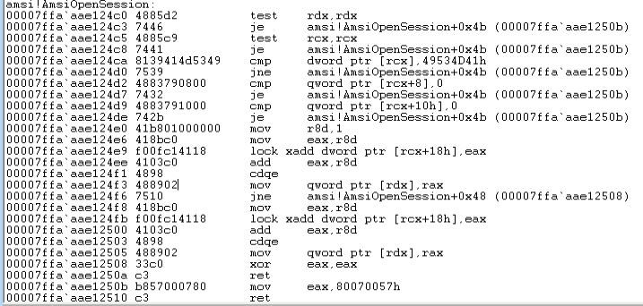

## Assembly Flow
In this section, we'll modify the assembly instructions themselves instead of the data they are acting upon in a technique known as _binary patching_.
We can use this technique to hotpatch the code and force it to fail even if the data structure is valid.

To understand the assembly flow, we start by dumping the contents of _AmsiOpenSession_ with WinDbg:

We unassembled all 0x1A instructions that make up _AmsiOpenSession_.
To force an error, we could just modify the very first bytes to the binary values that represent the last two instructions.

Apart from that, the conditional jump is controlled by the TEST instruction(first instruction) according to the argument and is executed if the [zero flag](https://en.wikipedia.org/wiki/Zero_flag) is equal to 1. If we modify the TEST instruction to an _XOR_ instruction, we may force the Zero flag to be set to 1 and trick the CPU into taking the conditional jump that leads to the invalid argument return value.

In summary, we will overwrite the TEST RDX,RDX with an XOR RAX,RAX instruction, forcing the execution flow to the error branch, which will disable AMSI.

NOTE:
There is one additional detail we need to take into account. When the original TEST RDX,RDX instruction is compiled, it is converted into the binary value 0x4885d2. This value takes up three bytes so the replacement, XOR RAX,RAX has to use up the same amount of memory.
XOR RAX,RAX is compiled into the binary value 0x4831c0, which luckily matches the number of bytes we require.