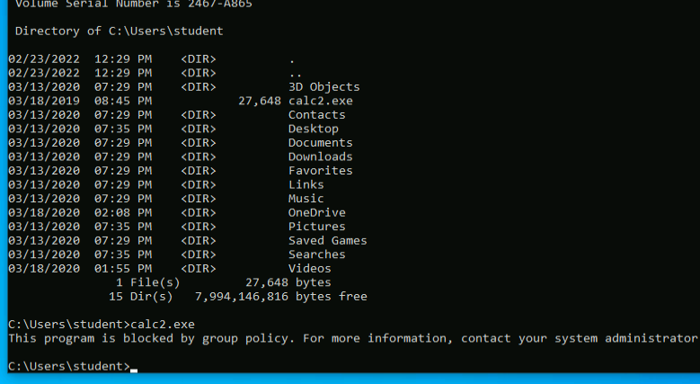
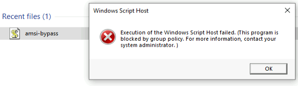

## The Need
Many organizations improve the security level of their endpoints with application whitelisting technology, which employs monitoring software that blocks all applications except those on a pre-defined whitelist. This effectively blocks custom applications or code, including many tools used by an attacker to obtain remote access or escalate privileges.

Application whitelisting is a very effective protection mechanism, but it can be difficult to manage and deploy at scale, and is not commonly deployed by larger organizations.

A typical Windows-based application whitelisting solution is installed as either a filter driver or through the HyperVisor.

## The Concept
The native Microsoft whitelisting implementation leverages a kernel-mode filter driver and various native kernel APIs.
Specifically, the Microsoft kernel-mode _PsSetCreateProcessNotifyRoutineEx_ API registers a notification callback which allows the execution of a provided kernel-mode function every time a new process is created.
Application whitelisting software uses a custom driver to register a callback function through this API.
This callback is then invoked every time a new process is created and it allows the whitelisting software to determine whether or not the application is whitelisted.

## AppLocker
[_AppLocker_](https://docs.microsoft.com/en-us/windows/security/threat-protection/windows-defender-application-control/applocker/what-is-applocker) was introduced with Windows 7 and is still available in current versions of Windows 10.
AppLocker components include the kernel-mode driver APPID.SYS and the _APPIDSVC_ user-mode service.
APPIDSVC manages the whitelisting ruleset and identifies applications when they are run based on the callback notifications from APPID.SYS.

## Configuring Applocker
We'll open an administrative command prompt and launch **gpedit.msc**.
To start configuring the applocker, In the Local Group Policy Editor, we'll navigate to _Local Computer Policy_ -> _Computer Configuration_ -> _Windows Settings_ -> _Security Settings_ -> _Application Control Policies_ and select the _AppLocker_.

For each of the 4 categories(executables, windows installer, scripts, packages), we will select "Configured". In addition, we can choose to "Enforce rules" to enable the rule and enforce whitelisting or "Audit only" which will allow execution and write an entry to the Windows event log.

Next, to configure rules for each of these, We'll click _Executable Rules_ to open a new window where we can enter the whitelisting rules related to each specific property.
Here, we'll select "Create Default Rules" to create default rules for all 4 categories.

Once we have created all the default rules, we must close the Local Group Policy Editor, and run **gpupdate /force** from the admin command prompt to refresh the active group policies.

Now that AppLocker is configured and enabled, non-admin users should not be able to execute any executable or script outside C:\\Program Files, C:\\Program Files (x86) and C:\\Windows.

Even executing a jscript file, in the students folder is blocked by applocker:

