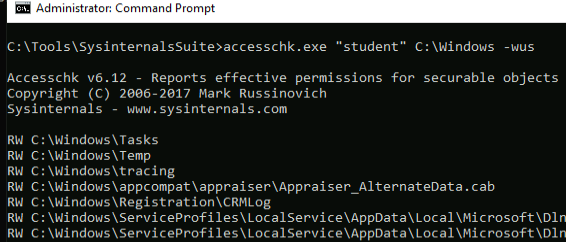
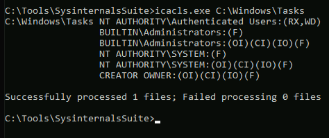
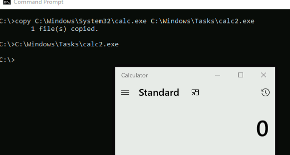

## How it Works
We should be able to execute a program or script in a subdirectory that allows both write and execute. If we can find writable and executable folders on a development machine, we can reuse the bypass later on a compromised machine which has the same rules applied.

## The Bypass
We'll search C:\\Windows with AccessChk as follows:



We then use icacls to check if any of the folders are executable:
```cmd
icacls.exe C:\Windows\Tasks
```



The output indicates the _RX_ flag (associated with the _NT AUTHORITY\\Authenticated Users_ group) is set for C:\\Windows\\Tasks, meaning that any user on the system will have both read and execute permissions within the directory.



Copying an executable to the C:\\Windows\\Tasks Folder, and executing it, we see that it runs the executable and applocker has been bypassed

