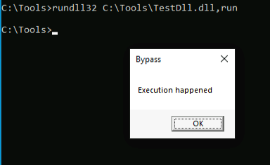
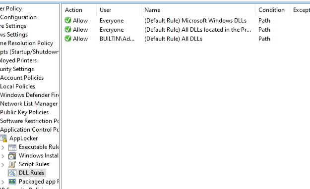
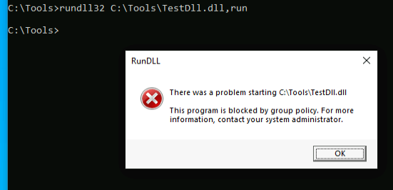
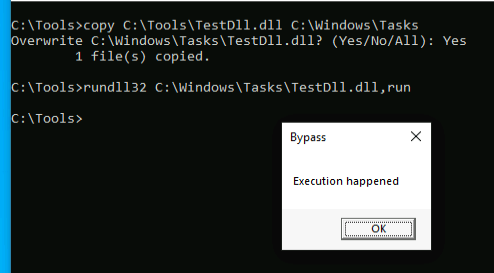

## Enable DLL Protection
The default ruleset doesn't protect against loading arbitrary DLLs. If we were to create an unmanaged DLL, we would be able to load it and trigger exported APIs to gain arbitrary code execution.

This can be shown using the Test.dll dll in an applocker configured folder:

To enable applocker's dll protection, we can go to advanced settings, enable rules for dll and then set default rules:

Now that, the rules are set, we run gpupdate /force to update the group policy and enable the applocker rules.

With this, we see that we cannot run the dll anymore:

However, as with previous topic, we can simply copy the dll to C:\\Windows\\Tasks directory to run the dll bypassing the applocke default rules.

