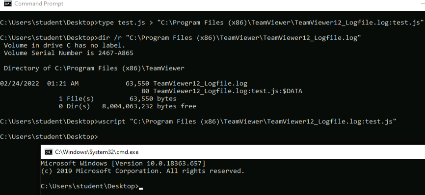
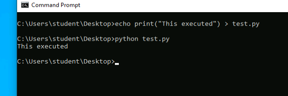

## Alternate Data Streams
Th modern Windows file system is based on the _NTFS_[1](https://portal.offensive-security.com/courses/pen-300/books-and-videos/modal/modules/application-whitelisting/basic-bypasses/alternate-data-streams#fn1) specification, which represents all files as a stream of data.
An _Alternate Data Stream_ (_ADS_) is a binary file attribute that contains metadata. We can leverage this to append the binary data of additional streams to the original file.

We start by creating a simple jscript that executes cmd.exe:
```cmd
var shell = new ActiveXObject("WScript.Shell");
var res = shell.Run("cmd.exe");
```

Since we have AppLocker scripting rules in place, we cannot execute it in its current location. However, if we can find a file in a trusted location that is both writable and executable, we could write the contents of this script to an alternate data stream inside that file and execute it, bypassing AppLocker.

Considering TeamViewer version 12.
(TeamViewer12_Logfile.log) that is both writable and executable by the student user. We can use the native _type_ command to copy the contents of test.js into an alternate data stream of the log file with the : notation

```cmd
type test.js > "C:\Program Files (x86)\TeamViewer\TeamViewer12_Logfile.log:test.js"
```

 If we now, execute it from the command line with wscript, specifying the ADS, the Jscript content is executed

 

 And thus, we bypass the applocker.


 ## Third Party Scripting Engines

 AppLocker only enforces rules against native Windows executable data file types. If a third-party scripting engine like Python or Perl is installed, we could use it to very easily bypass application whitelisting.

 Creating a small python script, we can execute it if python is previously installed(it is):
 
 

 