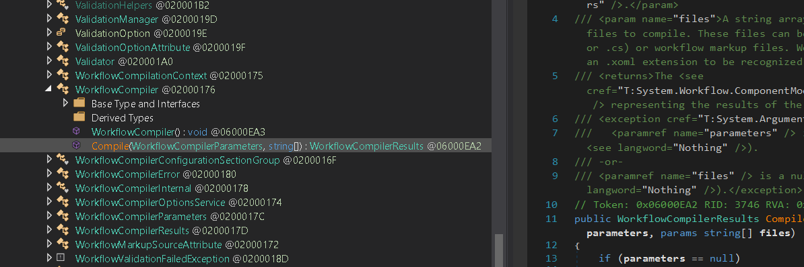
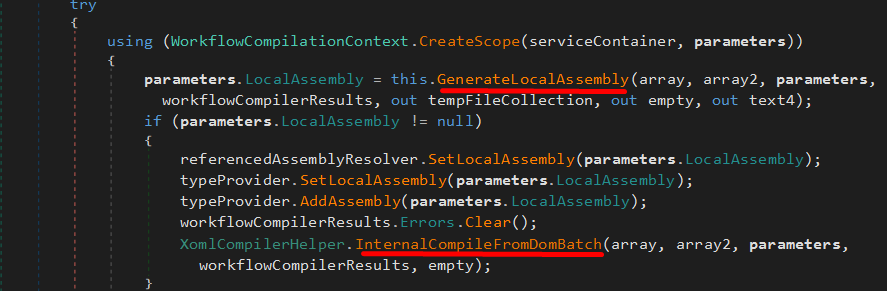
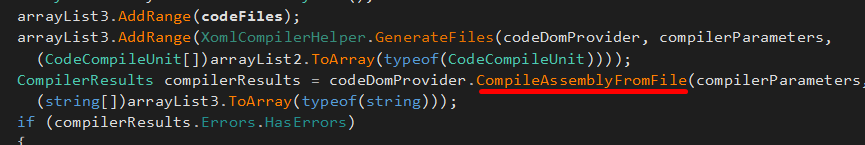
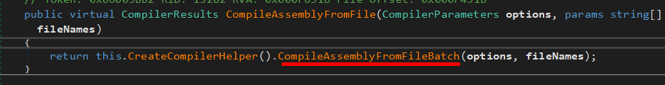
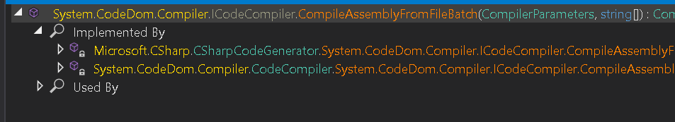
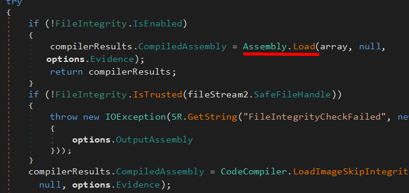
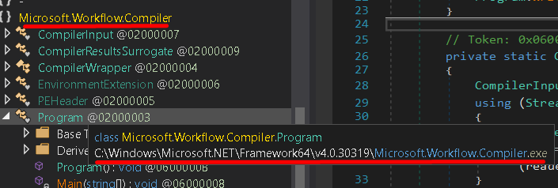
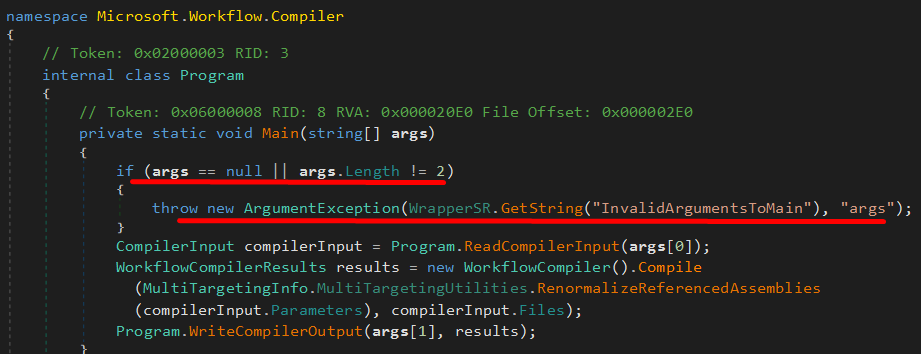
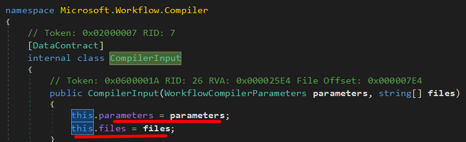

## Our Goal
 Our ultimate goal is to execute arbitrary C# code via a whitelisted application, which means our target application must either accept a pre-compiled executable as an argument and load it into memory or compile it itself.

 The first step in this process is therefore to locate native compiled managed code that  loads unsigned managed code into memory.

 We will reverse engineer assemblies which reside in whitelisted locations in search of the code segments that either load precompiled managed code or use source code which is compiled as part of the processing. Once identified, these code segments must execute the code we provide after it is loaded into memory.

 We'll be focussing on System.Workflow.ComponentModel.dll assembly which is vulnerable to a relatively new AppLocker bypass.
 This assembly is located in the 
 ```cmd
 C:\Windows\Microsoft.NET\Framework64\v4.0.30319
 ```
 directory which is whitelisted by AppLocker's default path rules.

 
 ## Reverse Engineering The Target
  
We'll use [dnSpy](https://github.com/dnSpy/dnSpy) which is the tool of choice for disassembling and performing reverse engineering on compiled .NET code.

To start the process of find a load method, the _System.Workflow.ComponentModel.Compiler_ namespace is worth investigating since compilation often involves loading a file or data.
Expanding the namespace reveals the _WorkflowCompiler_ class which contains the _Compile_ method.



The code
```c#
WorkflowCompilerResults workflowCompilerResults = workflowCompilerInternal.Compile(parameters, files);
```
calls into the internal _Compile_ method in the _WorkflowCompilerInternal_ namespace.
(clicking the code, takes us to it)

The _GenerateLocalAssembly_ and _InternalCompileFromDomBatch_ methods are especially interesting given that we are searching for a code segment responsible for compiling managed code.



Following the _GenerateLocalAssembly_ method, we find _CompileAssemblyFromFile_ method if we read the code:


 Following the call to this method reveals that this is a small wrapper method for _CompileAssemblyFromFileBatch_
 
 

 If we follow the call into _CompileAssemblyFromFileBatch_, we only find the method definition. There is no function implementation because this is part of an _interface_.

 To find the implementation of the interface from the _System.CodeDom.Compiler_ namespace, we'll right-click the method name and select _Analyze_, which will open a pane in the lower right-hand side of the application.

 

The method validates the supplied file paths and then calls _FromFileBatch_.
Within _FromFileBatch_, we find a call to the _Compile_ method, where the C# code supplied through _fileNames_ is finally compiled
Further on after the source code has been compiled and stored in the array variable, the code loads the now-compiled assembly with _Assembly.Load_.



NOTE: when the _FileIntegrity.IsEnabled_ property is evaluated, a call is made to _WldpIsDynamicCodePolicyEnabled_, which will only return true if WDAC is enabled and certain specific policies are enforced. Since we are only dealing with AppLocker, this does not apply to us, and this code path will execute.

We must ensure that we are actually able to invoke the _Compile_ method from the _WorkflowCompiler_ class inside System.Workflow.ComponentModel.dll. 
Additionally we must determine if we are able to control the arguments provided to it.

We could hover over the assembly name in Assembly Explorer to display the path name, to see the path of the excutable:



We must also determine if the arguments supplied to _Compile_ come directly from Microsoft.Workflow.Compiler.
We will start this analysis from the _Main_ method of Microsoft.Workflow.Compiler.exe and inspect the arguments it accepts.

The following image reveals that two arguments must be passed and that only the first is used with the _Compile_ method. The contents of the first argument are parsed by the _ReadCompilerInput_ method, which returns an object that contains compiler parameters and file names.



Any input to _Compile_ should be under user control. However the input does go through some sort of validation via _ReadCompilerInput_.

The content of the file passed as an argument is read into a stream, after which it is used to create an _XmlReader_ stream.
This means we must supply an XML file as the first argument to Microsoft.Workflow.Compiler.
After the _XmlReader_ stream is created, the _ReadObject_ method is used to deserialize the data of the stream and return it as the _CompilerInput_ type, which is a custom type defined inside Microsoft.Workflow.Compiler
If we click on the type, we find that it contains only two elements: _parameters_ and _files_:

