## Analysis For Code Exec
We'll analyze _InternalCompileFromDomBatch_ which follows after the _GenerateLocalAssembly_ call.
We notice that _GenerateLocalAssembly_ returns the newly compiled and loaded assembly inside the _LocalAssembly_ property of the _parameters_ variable. A reference to the assembly is subsequently stored in the _typeProvider_ variable.

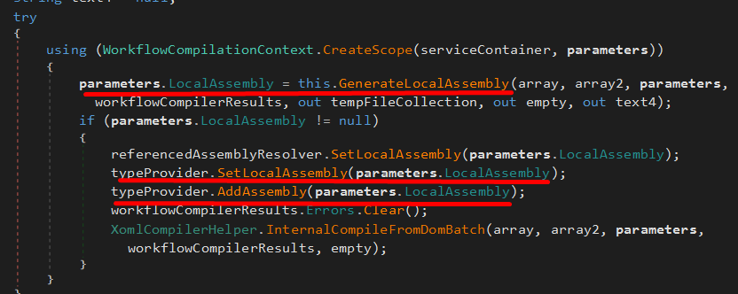

Following the call into _InternalCompileFromDomBatch_ we are lead into the _XomlCompilerHelper_ namespace. After some argument validation and variable initialization, we find the _foreach_ loop.
The loop iterates over all classes in the previously compiled file as given by the reference stored in the _typeProvider_ variable. For each iteration it checks for classes which [inherit](https://docs.microsoft.com/en-us/dotnet/csharp/tutorials/inheritance) from _System.Workflow.ComponentModel.Activity_ and are not [abstract](https://docs.microsoft.com/en-us/dotnet/csharp/language-reference/keywords/abstract).

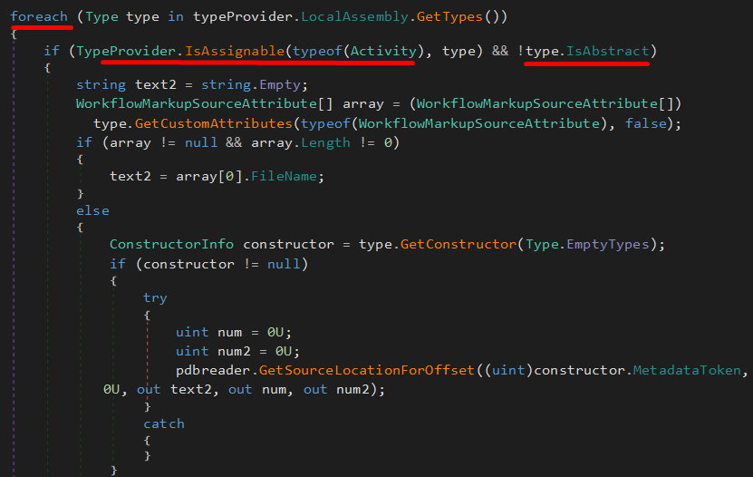

Assuming at least one such class exists, we go into the loop where the _CreateInstance_ method is invoked, which instantiates an object of the given type.
When an object is instantiated from a class, the defined constructor is executed.

The _Compile_ method of the _Compiler.WorkflowCompiler_ namespace is called with the path of a file containing C# source code given as an argument. After several iterations of validation and parsing, the provided .NET code is compiled into an assembly, loaded into memory, and if it contains a non-abstract class which inherits from the _Activity_ type, an object is instantiated.
If we are able to provide our desired code as part of the constructor for that class, we can obtain arbitrary code execution and bypass AppLocker.

## Getting Code Execution
The first command-line argument is a file path which is parsed by the _ReadCompilerInput_ method.
_ReadCompilerInput_ creates an _XmlReader_ stream after which the _ReadObject_ method is used to deserialize the data of the stream and return it as the type _CompilerInput_.
_ReadObject_ makes use of the _DataContractSerializer_ method to aid in the serialization.

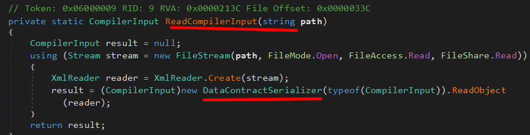

To analyze how to successfully serialize our input, we could attempt to locate code related to serialization inside the assembly.
For this, we right click _DataContractSerializer_ and select "Analyze", which tells us that it is only used in two methods
Besides the ReadCompilerInput method, _DataContractSerializer_ is only used in _SerializeInputToWrapper_, which has a very promising name.
The following code shows the seralization process:

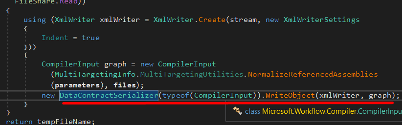

This code is perfect for our purposes since it serializes a data object of type _WorkflowCompilerParameters_ into an XML file on the filesystem.

We can simply create a PowerShell script that calls it.
The code will be have the following pointers:
1. Because the method is private, we must use reflection to locate it with _GetMethod_
2. With the method resolved, we must determine which arguments it accepts. The first are the _WorkflowCompilerParameters_. Fortunately, the type is public, meaning we can simply instantiate an object of this type. 
3. The second argument is an array of strings containing file paths.
4. Once we have set up the argument values, we can call the method through reflection with the _Invoke_ method:

```Powershell 
$workflowexe = "C:\Windows\Microsoft.NET\Framework64\v4.0.30319\Microsoft.Workflow.Compiler.exe"

$workflowasm = [Reflection.Assembly]::LoadFrom($workflowexe)

$SerializeInputToWrapper = 
[Microsoft.Workflow.Compiler.CompilerWrapper].GetMethod('SerializeInputToWrapper', [Reflection.BindingFlags] 'NonPublic, Static')

Add-Type -Path 
'C:\Windows\Microsoft.NET\Framework64\v4.0.30319\System.Workflow.ComponentModel.dll'

$compilerparam = New-Object -TypeName Workflow.ComponentModel.Compiler.WorkflowCompilerParameters

$compilerparam.GenerateInMemory = $True

$pathvar = "test.txt"

$output = "C:\Tools\test.xml"

$tmp = $SerializeInputToWrapper.Invoke($null, @([Workflow.ComponentModel.Compiler.WorkflowCompilerParameters] $compilerparam, [String[]] @(,$pathvar)))

Move-Item $tmp $output
```

After executing the code, we can dump the contents of the generated file to view the serialized content with:
```cmd
type C:\Tools\test.xml
```

the script gives us the following output:
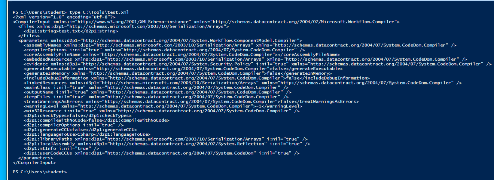

We notice 2 main things:
1. The file path we supplied has been embedded into it and will be used with the call to _Compile_ once the file is deserialized.
2. Quite a few compiler flags have been added, but at this time we do not know if the values they contain will lead us down the correct code path in order to process and execute an arbitrary malicious assembly file.


Going back to dnSpy, to the main method, we see the next call is to the _Compile_ method where the deserialized parameters and file names are supplied as arguments.
Following the code, we notice null checks on the input values after which various actions are performed depending on the given parameters.

The _OutputAssembly_ parameter is only checked and modified if the _GenerateInMemory_ flag is set.
Thus, we use the 
```Powershell
$compilerparam.GenerateInMemory = $True
```
code to set the _GenerateInMemory_ flag to true.

Following the call into the _Compile_ method of the _WorkflowCompilerInternal_ namespace, where we find the following _foreach_ loop

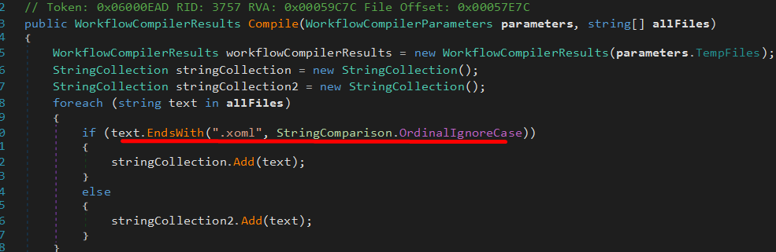

We find a comparison on the file name against the xoml extension.
File names with xoml extensions will be added to the _array_ variable while file names with other extensions will be added to _array2_. Since xoml files can contain embedded code, we can assume that this is a required file.
Going back to the _GenerateLocalAssembly_ call, looking at the defined function.
From the argument names, we find that the files with an xoml extension are called _files_, while those with any other extension are called _codeFiles_, which leads us to believe we should avoid xoml files.

This seems contradictory to the previous analysis.

However, reading the first call of the method:

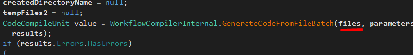
 
 shows that this method is given the _files_ variable, which contained the xoml files, as its first argument.
 (If we were to reverse engineer the method, we would discover rather extensive code designed to parse the files and detect and extract embedded code.)

 At the end of the code, the files containing code that were extracted from an xoml file are added into the _arrayList2_ variable, and those without this extension are added into the _arrayList3_ variable. In the second-to-last line of code, the extracted code is converted to files and added to _arrayList3_.

 In summary, we do not have to worry about the xoml files, and can simply pass C# code to load and execute arbitrary assembly.

 ## Final Parts Of Execution

In _InternalCompileFromDomBatch_ we find a check for classes that extend on the _Activity_
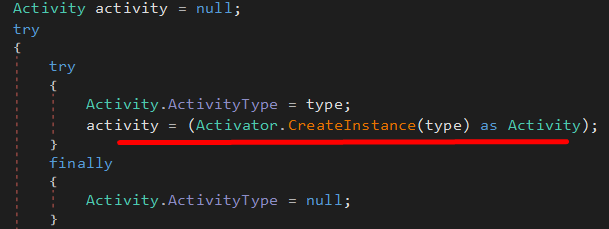

Each located class will subsequently be instantiated to an object through the _CreateInstance_ method by invoking the default constructor for the class.

This means that the file containing code we provide must contain a class that inherits from the _Activity_ class of the _System.Workflow.ComponentModel_ namespace and must contain the code we want to execute inside its constructor.

We build the following CSharp code:
```CSharp
using System;
using System.Workflow.ComponentModel;
public class Run : Activity{
    public Run() {
        Console.WriteLine("I executed!");
    }
}
```

There is, however, one last step left, that is, the 2nd argument for _Microsoft.Workflow.Compiler_.
The second command line argument is only used with the _WriteCompilerOutput_ method.

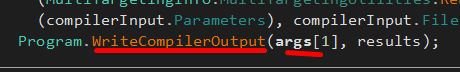

Following the call, this is revealed:

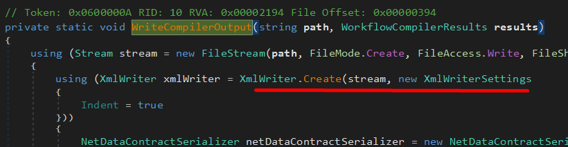

The argument is used as a file path, and content is written to it in XML format. Since we only care about obtaining code execution, we can simply pass a random file name as the second command line argument.

Now we have all we need to get the code execution.
```cmd
C:\Windows\Microsoft.Net\Framework64\v4.0.30319\Microsoft.Workflow.Compiler.exe run.xml results.xml
```

We do this by:
1. Creating a csharp file containing the code to be compiled and executed.
2. Running the powershell script, to generate an xml file.
3. Passing the xml file through the Microsoft.Workflow.Compiler.exe executable.

Doing this we achieve code execution.

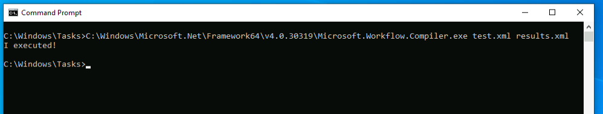