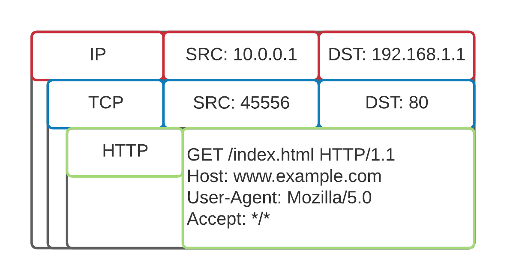
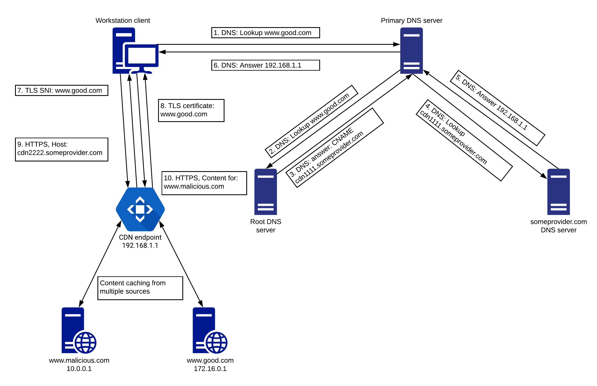

## What is it
At a very high level, the _Domain Fronting_ technique leverages the fact that large [_Content Delivery Networks_ (CDN)](https://en.wikipedia.org/wiki/Content_delivery_network) can be difficult to block or filter on a granular basis.
Depending on the feature set supported by a CDN provider, domain fronting allows us to fetch arbitrary website content from a CDN, even though the initial [TLS session](https://en.wikipedia.org/wiki/Transport_Layer_Security) is targeting a different domain.


## How Though?
This is possible as the TLS and the HTTP session are handled independently.
For example, we can initiate the TLS session to www.example1.com and then get the contents of www.example2.com 

With the advent of [_virtual hosting_](https://en.wikipedia.org/wiki/Virtual_hosting) multiple web sites associated with different domains could be hosted on a single machine, i.e. from a single IP address. The key to this functionality is the request HOST header, which specifies the target domain name, and optionally the port on which the web server is listening for the specified domain.

## Simple TCP packet
A TCP packet has a Host header, which specifies the actual host where the resource is located. This typically matches the domain name.
To better understand the need for a Host header, let's examine a simplified TCP/IP packet



1. After the DNS lookup is performed by the connecting client, the domain information is lost.
2. The server will only see the IP address where the client tries to connect (which is its IP).
3. Because of this, the target domain is represented in the HTTP request.

**Hosting server**
The following config file will be available on the host server:
```config
server {
        listen 80;
        listen [::]:80;

        root /var/www/example.com/html;
        index index.html index.htm index.nginx-debian.html;

        server_name example.com www.example.com;

        location / {
                try_files $uri $uri/ =404;
        }
}
```
1. On the hosting server itself, the Host header maps to a value in web server's configuration files.
2. The _server_name_ lists the available domain names this particular configuration applies to.
3. The _root_ field specifies what content is served for that domain name.

## TLS Connection Problems
When a client connects to a server that runs TLS, the situation is a bit different.

1. Because it is dealing with an encrypted connection, the server must also determine which certificate to send in the response based on the client's request.
2. Since the HTTP Host header is only available after the secure channel has been established, it can't be used to specify the target domain.
3. Instead, the TLS [_Server Name Indication_ (SNI)](https://en.wikipedia.org/wiki/Server_Name_Indication) field, which can be set in the "TLS Client Hello" packet during the TLS negotiation process, is used to specify the target domain and therefore the certificate that is sent in response.
4. In response to this, the "TLS Server Hello" packet contains the certificate for the domain that was indicated in the client request SNI field.


## Evasion Techniques
1. We can make an HTTPS connection to a server and set the SNI to indicate that we are accessing www.example1.com.
2. Once the TLS session is established and we start the HTTP session (over TLS), we can specify a different domain name in the Host header, for example www.example2.com.
3. This will cause the webserver to serve content for that website instead.


We can now tie this approach to Content Delivery Networks (CDN).
On a larger scale, a CDN provides geographically-optimized web content delivery. _CDN endpoints_ cache and serve the actual website content from multiple sources, and the HTTP request Host header is used to differentiate this content.
It can serve us any resource (typically a website) that is being hosted on the same CDN network.

Lookin at the following figure as an example for domain fronting:



Here:
1. The client initiates a DNS request to its primary DNS server to look up the IP of good.com.
2. The primary DNS server asks the root DNS server for the IP address of good.com.
3. The server replies with the configured CNAME record for that domain, which is cdn1111.someprovider.com.
4. The primary DNS server queries the someprovider.com DNS server for the cdn1111.someprovider.com domain.
5. The DNS server for someprovider.com replies with 192.168.1.1, which is the IP of the CDN endpoint.
6. The primary DNS sends the reply to the client.
7. The client initiates a TLS session to domain good.com to the CDN endpoint.
8. The CDN endpoint serves the certificate for good.com.
9. The client asks for the cdn2222.someprovider.com resource.
10. The CDN endpoint serves the contents of malicious.com.

In summary, this process of manipulating the Host and SNI headers in the traffic flow allows us to fetch content from sites that might be blocked otherwise and also allows us to hide our traffic. This process is known as domain fronting.