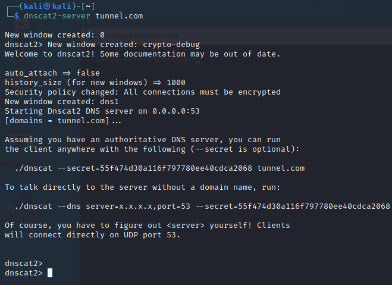
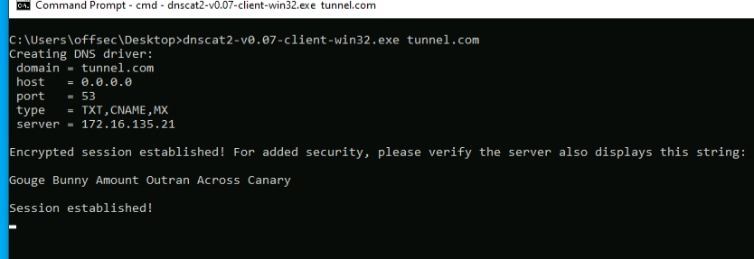

## Dnscat2
_dnscat2_ is a very popular and well-known DNS tunneling utility. It can tunnel traffic through multiple DNS records, such as A, TXT, and NS records.
It also includes a built-in command shell and can tunnel custom IP traffic to multiple locations.

To create a dns tunnel with dns cat, we first create a dnscat2-server with the domain "tunnel.com".

Next, we'll switch to the Windows machine and start dnscat2 from the Desktop, specifying the domain we are using for the tunnel.

With the session established, we have a dnscat2 shell which allows us to do multiple tasks.
We can start an smb tunnel throught the dns tunnel:
