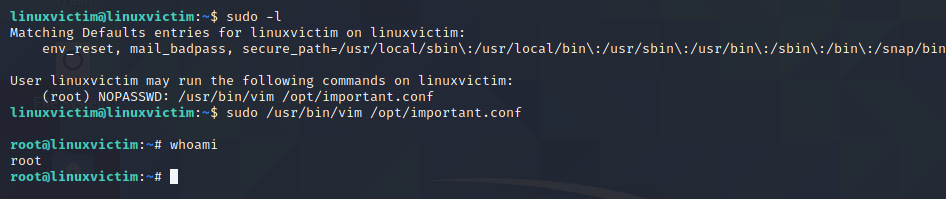

## Intro
In Linux systems, applications frequently store user-specific configuration files and subdirectories within a user's home directory. These files are often called "dotfiles" because they are prepended with a period. The prepended dot character tells the system not to display these files in basic file listings unless specifically requested by the user.

These configuration files control how applications behave for a specific user and are typically only writable by the user themselves or _root_.

For instance, we can modify .bash_profile or .bashrc to set environment variables or load scripts when a user initially logs in to a system.

Running the following commands will create a bashtest.txt file in the tmp directory 
everytime the user logs in or a new bash session is created:
```sh
echo "touch /tmp/bashtest.txt" >> ~/.bashrc
```

Now, if we run /bin/bash, we can see that a text file named bashtest.txt is created in the tmp directory due to the .bashrc config file

## VIM Config Simple Backdoor
The VIM editor is a widely used command line text editor on Linux and it (or its predecessor _vi_ is installed on nearly all Unix and Linux systems by default.

On many Linux systems, user-specific VIM configuration settings are located in a user's home directory in the .vimrc file.
This file takes VIM-specific scripting commands and configures the VIM environment when a user starts the application.
The commands specified in the .vimrc file are executed when VIM is launched. By editing this file, we can cause a user's VIM session to perform unintended actions on their behalf when VIM is run.

If we want to create a file somewhere on the system, we can enter a bash command in the 
configuration file or in the VIM editor itself, prepended with an exclamation point.
```Vim
!touch /tmp/test.txt
```


However, this isn't very stealthy.

We can "source" a shell script using the bash source command.
This loads a specified shell script and runs it for us during the normal configuration process.
We can also "import" other VIM configuration files into the user's current config with the :source command.
```Vim
!source ~/.vimrunscript
```
(we will store our script in ~/.vimrunscript)

**Importing Plugins**
As a more stealthy approach, we can leverage the VIM plugin directory. As long as the files have a .vim extension, all VIM config files located in the user's ~/.vim/plugin directory will be loaded when VIM is run.

If we try to run VIM now, we get an obvious debug output message explaining that we're sourcing a configuration file.
To counter this, we can use Vim's silent functionality which suppresses any errors or debug output messages.
```Vim
:silent !source ~/.vimrunscript
```

In an assessment on an Ubuntu, Red Hat, or similar system, if the user runs VIM via sudo, our script being sourced will also run as _root_.
On a Debian or similar system that does not persist the user's shell environment information when moving to a sudo context, we can add an _alias_ to the user's .bashrc file as follows:
```sh
alias sudo="sudo -E"
```
An alias is just a shortcut to substitute a different command when a specific command is entered on the command line.
We will need to source our .bashrc file from the command line if we want the alias changes to go into effect right away with:
```sh
source ~/.bashrc
```

## Sudo rights
In some cases, users are given limited sudo rights to run only specific programs.
This can be checked with the command
```sh
sudo -l
```
This limited access can be set in the /etc/sudoers

We can exploit this to get a root shell using the vim's ":shell" command:


