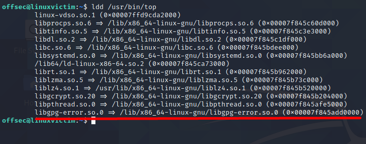
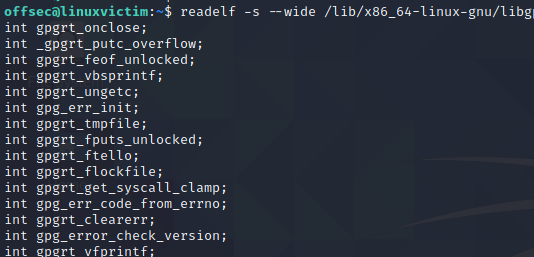
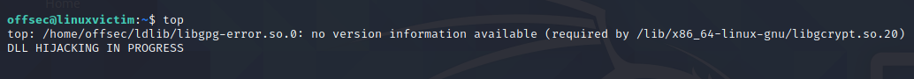

## LD_LIBRARY_PATH
Intended use cases for LD_LIBRARY_PATH include testing new library versions without modifying existing libraries or modifying the program's behavior temporarily for debugging purposes.

We'll exploit a victim user's application by creating a malicious library and then use _LD_LIBRARY_PATH_ to hijack the application's normal flow and execute our malicious code to escalate privileges.

We would want to insert a line in the user's .bashrc or .bash_profile to define the _LD_LIBRARY_PATH_ variable so it is set automatically when the user logs in.

As to counter the pass on of user environment variable to while using libraries as sudo, we can also add an alisa of "sudo" to "sudo -E" so as to bypass the _env_reset_ setting.

We start by creating a sample malicious shared library with c code as follows:
```C
#include <stdio.h>
#include <stdlib.h>
#include <unistd.h> // for setuid/setgid

static void runmahpayload() __attribute__((constructor));

void runmahpayload() {
	setuid(0);
	setgid(0);
    printf("DLL HIJACKING IN PROGRESS \n");
    system("touch /tmp/haxso.txt");
}
```
The fourth line provides a function declaration for a constructor function called _runmahpayload_.
Constructor functions are run when the library is first initialized in order to set up code for the library to use. (By doing this, we're just letting the compiler know that a function of this name will be defined later.)
We are creating a constructor function so that our malicious code will run when our library is loaded. 
The original program will try to load the library, which will then run our constructor function, triggering our malicious payload.

we can now compile our shared library with:
```sh
gcc -Wall -fPIC -c -o hax.o hax.c

gcc -shared -o libhax.so hax.o
```


In the second command, we're again using gcc to compile.
However, this time we use the -shared parameter to tell gcc we're creating a shared library from our object file.
This produces a libhax.so shared library file.

We will be targeting the _top_ command, which is used to display processes in real time on a Linux system.
We'll run the [ldd](https://man7.org/linux/man-pages/man1/ldd.1.html) command in the target machine on the top program. This will give us information on which libraries are being loaded when top is being run.



The last library listed appears to be a library for error reporting called LibGPG-Error.
This is likely to be loaded by the application but not likely to be called unless the program encounters an error, therefore this shouldn't prevent normal use of the application and is thus a good target.

We set our environment variable for _LD_LIBRARY_PATH_ and rename our .so file to match the one we're hijacking.
```sh
export LD_LIBRARY_PATH=/home/offsec/ldlib/
cp libhax.so libgpg-error.so.0
```

Running the top program should now run our malicious library.
However, we run into an error.
The error message states that we're missing the symbol _gpgrt_lock_lock_ with a version of _GPG_ERROR_1.0_. The program has not yet run our library's constructor, but it's already giving an error that we're missing [symbols](https://en.wikipedia.org/wiki/Symbol_(programming))
This means that certain variables or functions that the program expects to find when loading the original library have not been defined in our malicious library.

To fix this, we start by checking what symbols exist in the original shared library with the [readelf](https://linux.die.net/man/1/readelf) utility.

The error message specifies that the symbol it's looking for is tagged with _GPG_ERROR_1.0_ We can infer that it's part of the library we're replacing (libgpg-error.so.0).
By using a combination of bash commands, we can parse out the information we need specifically and put it into a format that we can paste directly into our library source code file to define variables.
We use the following command:
```sh
readelf -s --wide /lib/x86_64-linux-gnu/libgpg-error.so.0 | grep FUNC | grep GPG_ERROR | awk '{print "int",$8}' | sed 's/@@GPG_ERROR_1.0/;/g'
```

Here:
1. We call the readelf utility with the -s flag which gives a list of available symbols in the library.
2. We use the --wide flag to force it to include the untruncated names of the symbols and the full path to the original shared library.
3. We pipe the output to grep for lines containing the "FUNC" string representing symbols we need to capture.
4. We again pipe the output to grep "GPG_ERROR" string indicating they are stored in the library and not an unrelated dependency.
5. We pip the results to awk to capture only specific column of the the output and prepending "int" to it.
6. Finally, we pip the output to sed to replace the version information with a semicolon in order to finalize the variable definitions.

The result is a list of variable definitions, one for each missing symbol, that we can copy and paste just under our initial constructor definition in our hax.c source code file.



We simply copy/paste the output to our c program and compile it again into a shared library.
We get the desired output.



However, we get an error message about the shared library's version information.
It seems that _libgcrypt_ does require version information in associated libraries.

we can fix this with the help of a [map](https://www.gnu.org/software/gnulib/manual/html_node/LD-Version-Scripts.html) file that identifies particular symbols as being associated with a given version of the library.

We again run our previouse readelf command, but this time by omitting "int":
```sh
readelf -s --wide /lib/x86_64-linux-gnu/libgpg-error.so.0 | grep FUNC | grep GPG_ERROR | awk '{print $8}' | sed 's/@@GPG_ERROR_1.0/;/g'
```

This simply provides a list of symbols that we can then "wrap" into a symbol map file for the compiler to use. We'll call this file gpg.map.

Next, on the compilation part, we'll include the symbol file with --version-script.
```sh
gcc -Wall -fPIC -c -o hax.o hax.c
gcc -shared -Wl,--version-script gpg.map -o libgpg-error.so.0 hax.o
```
This time, we do not receive an error message.


## One Final Error
In case of LD_LIBRARY_PATH, the user's environment variables aren't passed to a sudo context even if sudo is being used.
Even if we use the "sudo -E" alias, they still would not be passed.

To Bypass this, we can edit our alias to include our _LD_LIBRARY_PATH_ variable explicitly.
We edit the .bashrc file and add the following at the end:
```sh
alias sudo="sudo LD_LIBRARY_PATH=/home/offsec/ldlib"
```

If we source the .bashrc file to load the changes we made, when we run the command with sudo, the command executes as _root_.
