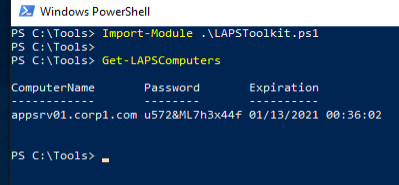

## Group Policy Preferences/AES
In an attempt to prevent attacks that leverage shared Administrator passwords, Microsoft introduced [_Group Policy Preferences_](https://docs.microsoft.com/en-us/previous-versions/windows/it-pro/windows-server-2012-r2-and-2012/dn581922(v%3Dws.11)) with Windows Server 2008
This allwed to centrally change local administrator account passwords.

However, this approach stored data in an XML file in a [_SYSVOL_](https://social.technet.microsoft.com/wiki/contents/articles/8548.active-directory-sysvol-and-netlogon.aspx) folder, which must be accessible to all computers in Active Directory.
The password would be AES encrpyted, however the release of encryption by Microsoft led to it's own doom.
The [_Get-GPPPassword_](https://github.com/PowerShellMafia/PowerSploit/blob/master/Exfiltration/Get-GPPPassword.ps1) PowerShell script could effectively locate and decrypt any passwords found in affected systems' SYSVOL folder.
Even thought GPP was patched by removing it, existing GPP containing passwords were not removed and thus may still exist.

## Local Administrator Password Solution
Introduced in 2015, local administrator password solution or LAPS was a secure and scalable way of remotely managing the local administrator password for domain-joined computers.

2 new AD attributes for computer object were introduced for LAPS.
1. _ms-mcs-AdmPwdExpirationTime_ : registers the expiration time of a password as directed through a group policy
2.  _ms-mcs-AdmPwd_ : contains the clear text password of the local administrator account

ms-mcs-AdmPwd attribute is _confidential_, meaning specific read permissions are required to access the content, which is normally assigned through group membership.

LAPS uses admpwd.dll to change the local administrator password and push the new password to the _ms-mcs-AdmPwd_ attribute of the associated computer object.

We can query LAPS to show us the clear text password using the [LAPSToolkit](https://github.com/leoloobeek/LAPSToolkit) which is a wrapper for [PowerView](https://github.com/PowerShellEmpire/PowerTools/tree/master/PowerView) Active Directory powershell script.

We can use the following commands to invoke LAPSToolkit, list all the computers set up with LAPS, read the clear text password stored and their expiration time:
```Powershell
Import-Module .\LAPSToolkit.ps1
Get-LAPSComputers
Find-LAPSDelegatedGroups
```

We can then use Powerview to enumerate the members of the group who can read the LAPS clear text passwords with:
```Powershell
Import-Module .\Powerview.ps1
Get-NetGroupMember -GroupName "LAPS Password Readers"
```

