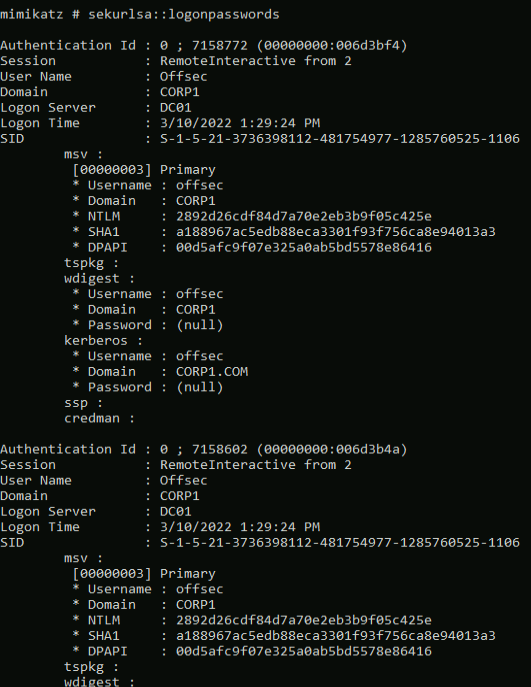
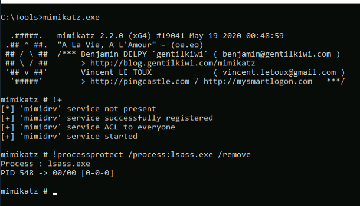

## Extracting Cached Creds
Due to the automatic renewal of TGTs, password hashes are cached in the _Local Security Authority Subsystem Service_ (LSASS) memory space.
If we gain access to these hashes, we could crack them to obtain the clear text password or reuse them to perform various actions (which we'll discuss in a later module).

[Mimikatz](https://github.com/gentilkiwi/mimikatz) written by security researcher Benjamin Delpy, is a powerful tool that we can use to extract and manipulate credentials, tokens, and privileges in Windows.

 We'll use the Mimikatz privilege::debug command to enable the _SeDebugPrivilege_ by calling _AdjustTokenPrivileges_
 Once we have enabled the _SeDebugPrivilege_ privilege, we'll dump all cached passwords and hashes from LSASS with sekurlsa::logonpasswords
 
 ```cmd
mimikatz.exe

privilege::debug

sekurlsa::logonpasswords
```



## LSA Protection
Windows divides its processes into four distinct integrity levels:
An additional mitigation level, _Protected Processes Light_ (PPL) was introduced from Windows 8 onwards, which can be layered on top of the current integrity level.

Process running at SYSTEM integrity cannot access or modify the memory space of a process executing at SYSTEM integrity with PPL enabled.

LSASS supports _PPL protection_,which can be enabled in the registry
```PATH
HKLM\SYSTEM\CurrentControlSet\Control\Lsa
```
with value "1".

With this enabled, the sekurlsa::logonpasswords command returns the error value 0x00000005 (Access denied).
PPL protection is controlled by a bit residing in the EPROCESS kernel object associated with the target process.

If we could obtain code execution in kernel space, we could disable the LSA protection and dump the credentials.
This can be achieved with Mimikatz since it comes bundled with the mimidrv.sys driver.

we need to have the _SeLoadDriverPrivilege_ privilege and the ability to load any signed drivers. Mimikatz can load the mimidrv.sys driver with the "!+" command.


Once the driver is loaded, we can use it to disable the PPL protection for LSASS through the "!processprotect" command while supplying the /process: option to specify the name of the process and the /remove flag to disable PPL
```cmd
!processprotect /process:lsass.exe /remove
```

Running sekurlsa::logonpasswords, we can now obtain the creds.

