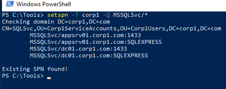
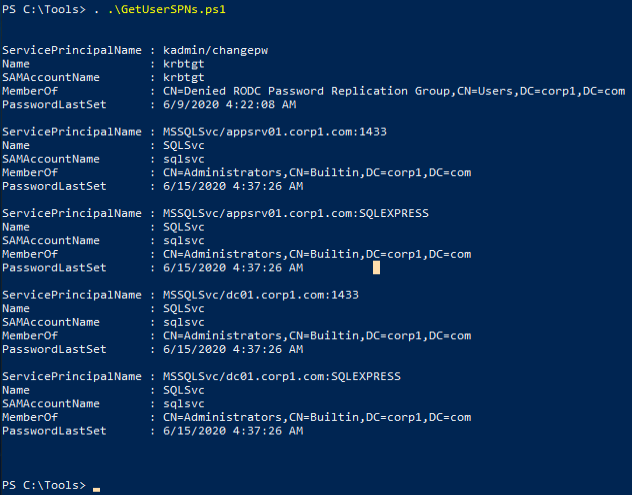

##  Enumeration
The traditional way to locate instances of SQL servers is through network scans with tools such as Nmap.
When a MS SQL server is running in the context of an Active Directory service account, it is normally associated with a _Service Principal Name_ (SPN).

A more discreet way of locating instances of MS SQL in an Active Directory environment is to query the domain controller for all registered SPNs related to MS SQL.
We can query the domain controller with the native [_setspn_](https://docs.microsoft.com/en-us/previous-versions/windows/it-pro/windows-server-2012-r2-and-2012/cc731241(v%3Dws.11)) tool.
```cmd
setspn -T corp1 -Q MSSQLSvc/*
```



We can also use the [GetUserSPN.ps1](https://github.com/nidem/kerberoast/blob/master/GetUserSPNs.ps1)  powershell script.
```cmd
. .\GetUserSPN.ps1
```



