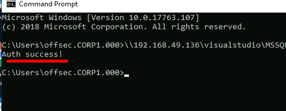
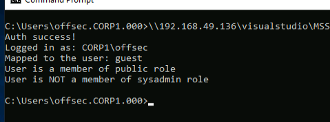

## C# Auth App
Authentication in MS SQL is implemented in two stages.
1. A traditional login is required(sql server login/windows account based [authentication](https://docs.microsoft.com/en-us/previous-versions/dotnet/framework/data/adonet/sql/authentication-in-sql-server))
		- SQL server login is performed with local accounts on each individual SQL server.
		- Windows authentication, works through Kerberos and allows any domain user to authenticate with a _Ticket Granting Service_ (TGS) ticket.
2. The login is mapped to a database user account.
(If we perform a login with an account that has no associated SQL user account, it will automatically be mapped to the built-in _guest_ user account.)

If Windows authentication is enabled, which is typically the case when the SQL server is integrated with Active Directory, we can authenticate through Kerberos.

We can start building a c# application in visual studio to authenticate to the database and run some enumeration queries.
We start by using the _System.Data.SqlClient_ namespace's [_SqlConnection_](https://docs.microsoft.com/en-us/dotnet/api/system.data.sqlclient.sqlconnection?view=netframework-4.8) class.
The constructor for _SqlConnection_ requires a [_ConnectionString_](https://docs.microsoft.com/en-us/dotnet/api/system.data.sqlclient.sqlconnection.connectionstring?view=netframework-4.8) as an argument.
The _ConnectionString_ consists of the following:
1. Hostname - dc01.corp1.com
2. Database name - master(default)
3. Integrated Security = "true" to choose windows authentiaction

Once the _SqlConnection_ object has been created, we use the _Open_ method to initiate the connection. If the connection attempt fails, an exception will occur. To handle this, we'll wrap it in a _try-catch_ clause
The code will be as follows:
```C#
using System;
using System.Data.SqlClient;

namespace SQL
{
    class Program
    {
        static void Main(string[] args)
        {
            String sqlServer = "dc01.corp1.com";
            String database = "master";

            String conString = "Server = " + sqlServer + "; Database = " + database + "; Integrated Security = True;";
            SqlConnection con = new SqlConnection(conString);

			try
            {
              con.Open();
              Console.WriteLine("Auth success!");
            }
            catch
            {
              Console.WriteLine("Auth failed");
              Environment.Exit(0);
            }

            con.Close();

        }
    }
}
```



This type of access is often possible on MS SQL because the _Builtin/Users_ group has access by default, and the _Domain Users_ group is a member of Builtin/Users. 
Since any domain account is a member of the Domain Users group, we automatically have access.

We can start to improve our code by revealing the sql login by executing the "SELECT [SYSTEM_USER](https://docs.microsoft.com/en-us/sql/t-sql/functions/system-user-transact-sql?view=sql-server-ver15)" statement.
To do this, we can use the SqlCommand class.
Instantiating an object from this class requires two arguments: the SQL query and the open connection to the SQL server.
To execute the SQL query, we invoke the [_ExecuteReader_](https://docs.microsoft.com/en-us/dotnet/api/system.data.sqlclient.sqlcommand.executereader?view=netframework-4.8) method, which forwards it to the SQL server and returns a [_SqlDataReader_](https://docs.microsoft.com/en-us/dotnet/api/system.data.sqlclient.sqldatareader?view=netframework-4.8) object.
We will then gain access to the data with the [Read](https://docs.microsoft.com/en-us/dotnet/api/system.data.sqlclient.sqldatareader.read?view=netframework-4.8#System_Data_SqlClient_SqlDataReader_Read) method.

With the access, we can now read the data, with the _SqlDataReader_ object using indexing where the array index specifies the zero-based column ordinal in the retrieved data row.
We print the result to console, and finally use the _Close_ method, on the SqlDataReader object to allow execute any other queries.

We can use the same code simply with the statement "SELECT USER_NAME()" to find out the username we're mapped to.

Finally, we'll use the [_IS_SRVROLEMEMBER_](https://docs.microsoft.com/en-us/sql/t-sql/functions/is-srvrolemember-transact-sql?view=sql-server-ver15) function, to determine if a specific login is a member of a specific server role.
The function accepts, the name of the role and returns a boolean value.

The final code will look something like this:
```C#
using System;
using System.Data.SqlClient;

namespace SQL
{
    class Program
    {
        static void Main(string[] args)
        {
            String sqlServer = "dc01.corp1.com";
            String database = "master";

            String conString = "Server = " + sqlServer + "; Database = " + database + "; Integrated Security = True;";
            SqlConnection con = new SqlConnection(conString);

			try
            {
              con.Open();
              Console.WriteLine("Auth success!");
            }
            catch
            {
              Console.WriteLine("Auth failed");
              Environment.Exit(0);
            }

			String querylogin = "SELECT SYSTEM_USER;";
            SqlCommand command = new SqlCommand(querylogin, con);
            SqlDataReader reader = command.ExecuteReader();

			reader.Read();
            Console.WriteLine("Logged in as: " + reader[0]);
            reader.Close();

			String querylogin = "SELECT USER_NAME();";
            SqlCommand command = new SqlCommand(querylogin, con);
            SqlDataReader reader = command.ExecuteReader();

			reader.Read();
            Console.WriteLine("Mapped to the user: " + reader[0]);
            reader.Close();

			String querypublicrole = "SELECT IS_SRVROLEMEMBER('public');";
            command = new SqlCommand(querypublicrole, con);
            
            reader = command.ExecuteReader();
            reader.Read();
            
            Int32 role = Int32.Parse(reader[0].ToString());
            if(role == 1)
            {
              Console.WriteLine("User is a member of public role");
            }
            else
            {
              Console.WriteLine("User is NOT a member of public role");
            }
            
            reader.Close();

			String querypublicrole = "SELECT IS_SRVROLEMEMBER('sysadmin');";
            command = new SqlCommand(querypublicrole, con);
            
            reader = command.ExecuteReader();
            reader.Read();
            
            Int32 role = Int32.Parse(reader[0].ToString());
            if(role == 1)
            {
              Console.WriteLine("User is a member of sysadmin role");
            }
            else
            {
              Console.WriteLine("User is NOT a member of sysadmin role");
            }
            
            reader.Close();
            
            con.Close();

        }
    }
}
```

Result:
