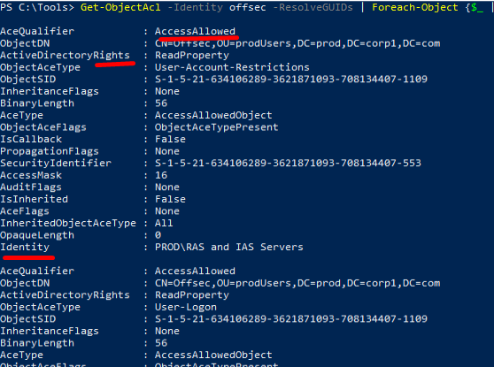

## Terminology
Within Active Directory, access to an object is controlled through a _Discretionary Access Control List_ (DACL), which consists of a series of [_Access Control Entries_ (ACE).](https://docs.microsoft.com/en-us/windows/win32/secauthz/dacls-and-aces)
Each ACE defines whether access to the object is allowed or denied, which entity the ACE applies to, and the type of access.

An ACE is stored according to the [_Security Descriptor Definition Language_ (SDDL)](https://docs.microsoft.com/en-us/windows/win32/secauthz/security-descriptor-definition-language) which is a string delimited by semicolons.
Each element of the ACE string consists of one or more concatenated values.
1. ace_type
2. ace_flags
3. [access rights](https://docs.microsoft.com/en-us/windows/win32/secauthz/access-rights-and-access-masks)
4. object_guid/inherit_object_guid
5. account_sid

Improperly configured DACLs can lead to compromise of user accounts, domain groups, or even computers
Also, all authenticated domain users can read AD objects (such as users, computers, and groups) and their DACLs, meaning we can enumerate weak ACL configurations from a compromised low-privilege domain user account.
We can use the PowerView.ps1 script, for the same.
```powershell
. ./powerview.ps1

Get-ObjectAcl -Identity offsec -ResolveGUIDs | Foreach-Object {$_ | Add-Member -NotePropertyName Identity -NotePropertyValue (ConvertFrom-SID $_.SecurityIdentifier.value) -Force; $_}
```



