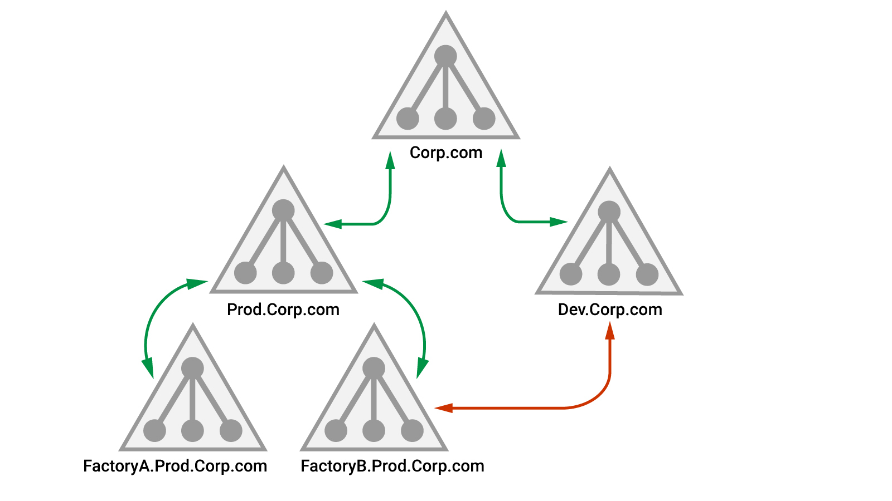

## Theory
A forest is **a logical construct used by Active Directory Domain Services (AD DS) to group one or more domains**. 
The domains then store objects for user or groups, and provide authentication services.

The main concept  is _trust_, which allows two or more domains to extend Kerberos authentication to each other.
The combination of Kerberos authentication and trust makes it possible to assign permissions to users in Domain 1 so that they can access services, like files and shares, inside Domain 2.

When trust is established, a TGT created in Domain 2 is usable in Domain 1 because the DC in Domain 1 trusts the domain controller in Domain 2.

In the following image:

Due to the transitivity in parent-child trust, FactoryB.Prod.Corp.com trusts Dev.Corp.com but the authentication path has to go through both Prod.Corp.com and Corp.com, which will slow authentication. To improve efficiency, a _shortcut trust_ can be established
Each of the domains in a forest operates as a single unit and have all the built-in groups and users we know from a single domain design.
However, the _Enterprise Admins_ group is an extremely powerful group that only exists in the root domain.