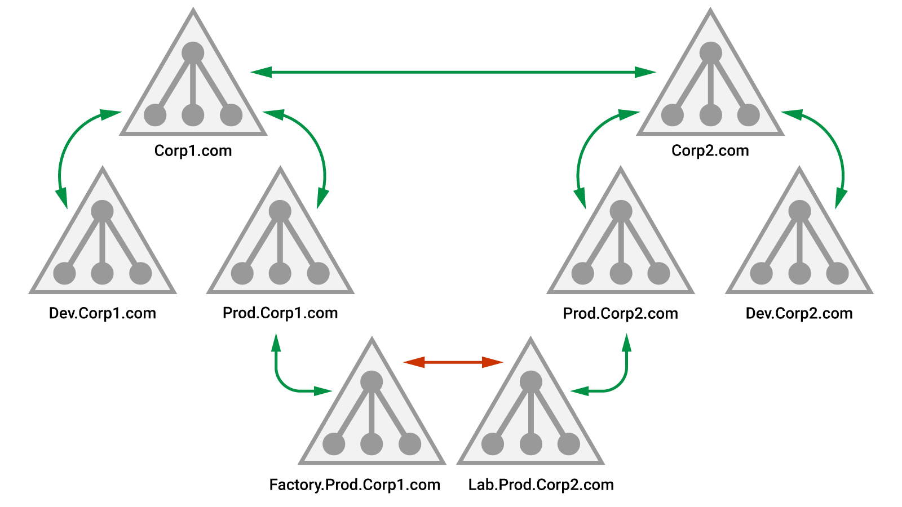

## Trust Between Forests
We'll take the example of the following forest trust:



In this _forest trust_, both forests trust the other.
Like a domain trust, a forest trust can be one-way or bi-directional.

The forest trust is transitive between domains, such that Dev.Corp1.com will trust Dev.Corp2.com but it is not transitive between multiple forests.
Meaning, If Corp2.com were to have a trust to an additional domain, namely Corp3.com, Corp1.com would not automatically have a trust to Corp3.com.
External trust is also non-transitive.

The intraforest and interforest trust differ from an enumeration standpoint.
The optional _selective authentication_ setting limits access across a forest trust to only specific users against specific objects.

## Enumeration
The first enumeration step is to map out any forest trusts. This can be done easily with .NET through the _Forest.GetAllTrustRelationships_ method.
We can again use powerview with the following command:
```Powershell
Get-ForestTrust
```

We can enumerate trusts to child domains inside corp2.com with Get-DomainTrust by specifying the root domain and then continue with any discovered child domains.
```Powershell
Get-DomainTrust -Domain corp1.com
```

We can use the following command to automate the enumeration of forest trusts:
```Powershell
Get-DomainTrustMapping
```

We can enumerate other objects like users, groups, etc. by specifiying the -domain parameter in powerview:
```Powershell
Get-DomainUser -Domain corp2.com
```

One simple approach is to search for users with the **same username** in both forests as they might belong to the same employee. If such an account exists, there is a chance that the accounts share a password, which could grant us access.

Also, We can use the PowerView Get-DomainForeignGroupMember method to enumerate groups in a trusted forest or domain that contains non-native members.
```Powershell
Get-DomainForeignGroupMember -Domain corp2.com
```