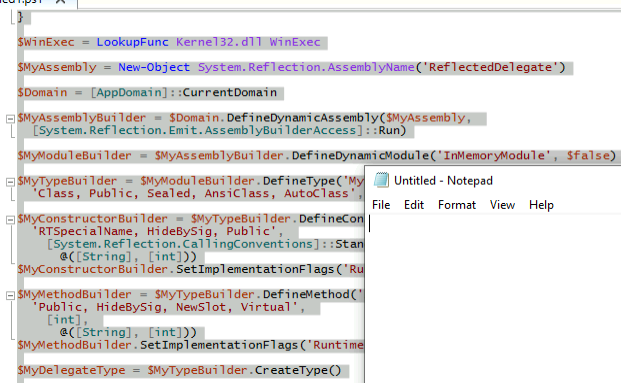

## Final code
Our final code looks something like so:
```Powershell
function LookupFunc {

	Param ($moduleName, $functionName)

	$assem = ([AppDomain]::CurrentDomain.GetAssemblies() | 
    Where-Object { $_.GlobalAssemblyCache -And $_.Location.Split('\\')[-1].
      Equals('System.dll') }).GetType('Microsoft.Win32.UnsafeNativeMethods')
    $tmp=@()
    $assem.GetMethods() | ForEach-Object {If($_.Name -eq "GetProcAddress") {$tmp+=$_}}
	return $tmp[0].Invoke($null, @(($assem.GetMethod('GetModuleHandle')).Invoke($null, @($moduleName)), $functionName))
}

$MessageBoxA = LookupFunc user32.dll MessageBoxA

$MyAssembly = New-Object System.Reflection.AssemblyName('ReflectedDelegate')

$Domain = [AppDomain]::CurrentDomain

$MyAssemblyBuilder = $Domain.DefineDynamicAssembly($MyAssembly, 
  [System.Reflection.Emit.AssemblyBuilderAccess]::Run)

$MyModuleBuilder = $MyAssemblyBuilder.DefineDynamicModule('InMemoryModule', $false)

$MyTypeBuilder = $MyModuleBuilder.DefineType('MyDelegateType', 
  'Class, Public, Sealed, AnsiClass, AutoClass', [System.MulticastDelegate])


$MyConstructorBuilder = $MyTypeBuilder.DefineConstructor(
  'RTSpecialName, HideBySig, Public', 
    [System.Reflection.CallingConventions]::Standard, 
      @([IntPtr], [String], [String], [int]))
$MyConstructorBuilder.SetImplementationFlags('Runtime, Managed')

$MyMethodBuilder = $MyTypeBuilder.DefineMethod('Invoke', 
  'Public, HideBySig, NewSlot, Virtual', 
    [int], 
      @([IntPtr], [String], [String], [int]))
$MyMethodBuilder.SetImplementationFlags('Runtime, Managed')

$MyDelegateType = $MyTypeBuilder.CreateType()

$MyFunction = [System.Runtime.InteropServices.Marshal]::
    GetDelegateForFunctionPointer($MessageBoxA, $MyDelegateType)

$MyFunction.Invoke([IntPtr]::Zero,"Hello World","This is My MessageBox",0)
```


## Exercise
We need to open a notepad using WinExec Win32 API by editing our built code.
To do this we follow these steps:
1. We first change our $MessageBoxA variable name to $WinExec for conventional look.
2. We then change the arguments to Kernel32.dll as the module name and WinExec as the function name.
3. We then proceed to change the arguments of the DefineConstructor method of the $MyConstructorBuilder variable.
			- We change the arguments from 4 to 2, which are String and int.
4. We then change the arguments of the DefineMethod method of the $MyMethodBuilder vairable.
		- We inculcate the same change as in step 3
5. Finally, we change the arguments in the final call of the function to:
			- The path of the notepad executable
			- The integer "1" to open a [window](https://docs.microsoft.com/en-us/windows/win32/api/winuser/nf-winuser-showwindow#parameters) 

The final code looks something like so:
```Powershell
function LookupFunc {

        Param ($moduleName, $functionName)

        $assem = ([AppDomain]::CurrentDomain.GetAssemblies() | 
    Where-Object { $_.GlobalAssemblyCache -And $_.Location.Split('\\')[-1].
      Equals('System.dll') }).GetType('Microsoft.Win32.UnsafeNativeMethods')
    $tmp=@()
    $assem.GetMethods() | ForEach-Object {If($_.Name -eq "GetProcAddress") {$tmp+=$_}}
        return $tmp[0].Invoke($null, @(($assem.GetMethod('GetModuleHandle')).Invoke($null, @($moduleName)), $functionName))
}

$WinExec = LookupFunc Kernel32.dll WinExec

$MyAssembly = New-Object System.Reflection.AssemblyName('ReflectedDelegate')

$Domain = [AppDomain]::CurrentDomain

$MyAssemblyBuilder = $Domain.DefineDynamicAssembly($MyAssembly, 
  [System.Reflection.Emit.AssemblyBuilderAccess]::Run)

$MyModuleBuilder = $MyAssemblyBuilder.DefineDynamicModule('InMemoryModule', $false)

$MyTypeBuilder = $MyModuleBuilder.DefineType('MyDelegateType', 
  'Class, Public, Sealed, AnsiClass, AutoClass', [System.MulticastDelegate])

$MyConstructorBuilder = $MyTypeBuilder.DefineConstructor(
  'RTSpecialName, HideBySig, Public', 
    [System.Reflection.CallingConventions]::Standard, 
      @([String], [int]))
$MyConstructorBuilder.SetImplementationFlags('Runtime, Managed')

$MyMethodBuilder = $MyTypeBuilder.DefineMethod('Invoke', 
  'Public, HideBySig, NewSlot, Virtual', 
    [int], 
      @([String], [int]))
$MyMethodBuilder.SetImplementationFlags('Runtime, Managed')

$MyDelegateType = $MyTypeBuilder.CreateType()


$MyFunction = [System.Runtime.InteropServices.Marshal]::
    GetDelegateForFunctionPointer($WinExec, $MyDelegateType)

$MyFunction.Invoke('C:\Windows\System32\Notepad.exe', 1)
```

