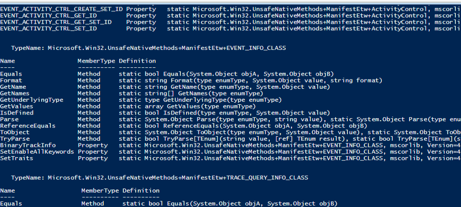
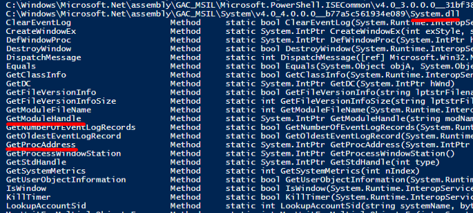

## The Need
Our shell are fully executing in memory and can be evaded by antivirus scanning the disk.
However, PowerShell and the .NET framework leave artifacts on the hard drive that antivirus programs can identify.

In this final section, we will be dealing with the same problem.

We will use the .NET framweork's [reflection](https://docs.microsoft.com/en-us/dotnet/csharp/programming-guide/concepts/reflection) technique to avoid creating the artifacts that can be detected by antivirus.

## Using UnsafeNativeMethods
Our last shellcode in memory executed 3 primary steps:
- Located the function
- Specified Argument data types from C to C# to powershell
- Invoke the function
 
There are 2 ways to locate functions in unmaged DLLs:
1. The Add-type function we used previously
2. Dynamic Link Lookup

### Wtf is Dynamic link lookup?
It's a way to locate functions in unmanaged DLLs by low level languages like C.
With this path, we can create a .NET assembly in memory instead of writing the code and compiling it on disk.
(yea, complicated.)

## Locating our functions

For this, we will be using 2 main Win32 APIs, these are;
1. [GetModuleHandle](https://docs.microsoft.com/en-us/windows/win32/api/libloaderapi/nf-libloaderapi-getmodulehandlea)
2. [GetProcAddress](https://docs.microsoft.com/en-us/windows/win32/api/libloaderapi/nf-libloaderapi-getprocaddress)

We can use these, but we need to use these without using Add-type

We can use the following code, to look for existing assemblies that match our criteria:
```Powershell
$Assemblies = [AppDomain]::CurrentDomain.GetAssemblies()

$Assemblies |
  ForEach-Object {
    $_.GetTypes()|
      ForEach-Object {
          $_ | Get-Member -Static| Where-Object {
            $_.TypeName.Contains('Unsafe')
          }
      } 2> $null
    }
```

Code summary:
- We first use GetAssemblies to search preloaded assemblies in the powershell process.
- Since each assembly is actually just an object, we'll use the ForEach-Object loop.
- We'll then use Get-types, with the \$_ variable which will contain the current object for each loop, to obtain their methods and structures.
- Then, for each object obtained we're performing another ForEach-Object loop and invoking the Get-Member cmdlet with the -Static flag to only locate static properties and methods.

In C#, when the code wants to directly invoke Win32 APIs, it must provide the Unsafe keyword indicating the use of TypeName.Contains('Unsafe') typename .
Also, the function used must be declared as static to avoid instantiation indicating the use of the -Static flag.



The search gives a big response including 16 occurances of _GetModuleHandle_ and _GetProcAddress_.
Looking for GetModuleHandle, one of them is located in the Microsoft.Win32.UnsafeNativeMethods class.
We also see GetProcAddress in the same class.

We now want to find what assembly are the functions located in, for this, we modify the code as follows:
```Powershell
$Assemblies = [AppDomain]::CurrentDomain.GetAssemblies()

$Assemblies |
  ForEach-Object {
    $_.Location
    $_.GetTypes()|
      ForEach-Object {
          $_ | Get-Member -Static| Where-Object {
            $_.TypeName.Equals('Microsoft.Win32.UnsafeNativeMethods')
          }
      } 2> $null
    }
```
- We add the Location property in the first loop to print the current assembly location.
-  We also add the TypeName.Equals('Microsoft.Win32.UnsafeNativeMethods') typename to match our needed method instead of all methods

]

The output shows that the assembly for our functions is System.dll.


### Problem?
We can't use these methods because they're only meant to be used internally by the .NET code. 0_0 Great.

But we have a work around!


### Solution.
We're gonna develop a way to indirectly call them from Powershell or C#

We start by obtaining a reference to the System.dll assembly with the Get-Type method.
This reference, will then allow us to locate the methods we need.

Code:
```Powershell
$systemdll = ([AppDomain]::CurrentDomain.GetAssemblies() | Where-Object { 
  $_.GlobalAssemblyCache -And $_.Location.Split('\\')[-1].Equals('System.dll') })
  
$unsafeObj = $systemdll.GetType('Microsoft.Win32.UnsafeNativeMethods')
```
- We start by piping all the assemblies to a Where-Object on 2 conditions:
		- The GlobalAssemblyCache property is set. It's a list of all native and registered assemblies on Windows, which evidently lets us filter out the non-native assemblies.
		- The Location property is a filter to set the last part of the file with System.dll
		- We also use the Split method of the Location property to set a directory delimiter(\\)
		- We select the last element of the object using "-1" and see if it equals to System.dll
- This technique is called [Reflection](https://docs.microsoft.com/en-us/dotnet/csharp/programming-guide/concepts/reflection)
- This technique lets us access references to objects that are otherwise internal.

We also use Reflection to access the GetModuleHandle method:
```Powershell
$GetModuleHandle = $unsafeObj.GetMethod('GetModuleHandle')
```

### Moving on
Now that we have our function, we can proceed to use the internal Invoke method to call GetModuleHandle and obtain the base address of an unmanaged DLL

The Invoke method takes 2 arguments:
1. The object to invoke it on, but since we use it on a static method, we can set it to null
2. An array consisting of the arguments for the GetModuleHandle method. We will be supplying the name of the dll.

Code:
```Powershell
$GetModuleHandle.Invoke($null, @("user32.dll"))
```

Moving on the GetProcAddress, we will again use the reflection technique to obtain our funciton:
```Powershell
$GetProcAddress = $unsafeObj.GetMethod('GetProcAddress')
```

However, we run into an error "Ambiguous match found."
This happens because there are multiple instances of GetProcAddress with the _Microsoft.Win32.UnsafeNativeMethods_.
Solution?
We just need to use GetMethods to obtain all of them and then we can proceed to filter out the one we need.
We can do this by changing our code to this:
```Powershell
$unsafeObj.GetMethods() | ForEach-Object {If($_.Name -eq "GetProcAddress") {$_}}
```

We can use this by:
1. Creating an empty array and store both of them in it.
2. Referencing the element of the array to access the function.

The following code will do so:
```Powershell
$user32 = $GetModuleHandle.Invoke($null, @("user32.dll"))
$tmp=@()
$unsafeObj.GetMethods() | ForEach-Object {If($_.Name -eq "GetProcAddress") {$tmp+=$_}}
$GetProcAddress = $tmp[0]
$GetProcAddress.Invoke($null, @($user32, "MessageBoxA"))
```
The C version of GetProcAddress takes 2 arguments:
- Base address of the DLL - $user32 array
- Name of the function - MessageBoxA

Our final code to locate the function will look like so:
```Powershell
function LookupFunc {

	Param ($moduleName, $functionName)

	$assem = ([AppDomain]::CurrentDomain.GetAssemblies() | 
    Where-Object { $_.GlobalAssemblyCache -And $_.Location.Split('\\')[-1].
      Equals('System.dll') }).GetType('Microsoft.Win32.UnsafeNativeMethods')
    $tmp=@()
    $assem.GetMethods() | ForEach-Object {If($_.Name -eq "GetProcAddress") {$tmp+=$_}}
	return $tmp[0].Invoke($null, @(($assem.GetMethod('GetModuleHandle')).Invoke($null, @($moduleName)), $functionName))
}
```

## Defining Argument Types
Now that we can resolve addresses of the Win32 APIs, we must define the argument types.

We need to start by resolving the information about number of function's arguments and their data types to the function's memory address.
In C#, this is done by the [_GetDelegateForFunctionPointer_](https://docs.microsoft.com/en-us/dotnet/api/system.runtime.interopservices.marshal.getdelegateforfunctionpointer?view=netframework-4.8) 
note: In C#, a function prototype is known as a _Delegate_

We can declare a delegate in C# for a function as follows:
```C#
int delegate MessageBoxSig(IntPtr hWnd, String text, String caption, int options);
```

However, there is no equivalent to the _delegate_ keyword in PowerShell so we must obtain this in a different manner.
We will do this by first manually creating an assembly and then populating it with content.

We start by creating a new assembly object using the [AssemblyName](https://docs.microsoft.com/en-us/dotnet/api/system.reflection.assemblyname?view=netframework-4.8) class and assign it a name.
The code is as follows:
```Powershell
$MyAssembly = New-Object System.Reflection.AssemblyName('ReflectedDelegate')
```
Here, we created a variable and set it to the instantiated assembly object with a name.

This assembly needs to be an executable and not saved on the disk for our evasion to be right on it's track.
We can do this with the [_DefineDynamicAssembly_](https://docs.microsoft.com/en-us/dotnet/api/system.reflection.emit.assemblybuilder.definedynamicassembly?view=netframework-4.8) method.
This will take 2 arguements:
1. The custom assembly name
2. Access mode (We set it as an executable by supplying the Run access mode in the _System.Reflection.Emit.AssemblyBuilderAccess_ namespace)

Code:
```Powershell
$Domain = [AppDomain]::CurrentDomain
$MyAssemblyBuilder = $Domain.DefineDynamicAssembly($MyAssembly, 
  [System.Reflection.Emit.AssemblyBuilderAccess]::Run)
```

We can now start populating the assembly with content.

We start by creating our main building block i.e. a Module. We will do this throught the [_DefineDynamicModule_](https://docs.microsoft.com/en-us/dotnet/api/system.reflection.emit.assemblybuilder.definedynamicmodule?view=netframework-4.8) method.
The method takes 2 arguments:
1. A custom name
2. Boolean(Wheather to include symbol information)

```Powershell
$MyModuleBuilder = $MyAssemblyBuilder.DefineDynamicModule('InMemoryModule', $false)
```

We will now use the [_DefineType_](https://docs.microsoft.com/en-us/dotnet/api/system.reflection.emit.modulebuilder.definetype?view=netframework-4.8#System_Reflection_Emit_ModuleBuilder_DefineType_System_String_System_Reflection_TypeAttributes_) method to create a custom type.
For this, we set 3 arguments:
1. A custom name
2. A combined list attributes for the type:
			- Class (For the type to be a class)
			- Public (For it to be accessible)
			- Sealed (For it to be non-extendable)
			- AnsiClass (For it to use ASCII instead of Unicode)
			- AutoClass (For it to be interpreted automatically)
3. The type it builds on top of

We build our custom type as follows:
```Powershell
$MyTypeBuilder = $MyModuleBuilder.DefineType('MyDelegateType', 
  'Class, Public, Sealed, AnsiClass, AutoClass', [System.MulticastDelegate])
```
(We use the System.MulticastDelegate to create a delegate with multiple entries)

We can now proceed to put the function prototype inside the custom type and let it become our custom delegate!
We do this by defining a constructor with the [_DefineConstructor_](https://docs.microsoft.com/en-us/dotnet/api/system.reflection.emit.typebuilder.defineconstructor?view=netframework-4.8) method. which takes 3 arguments:
1. Attributes for the constructor itself, defined with the [_MethodAttributes Enum_](https://docs.microsoft.com/en-us/dotnet/api/system.reflection.methodattributes?view=netframework-4.8). We chose RTSpecialName, HideBySig and Public, for it to be referenced by both, by name and signature, and also make it public.
2. Calling the convention for the constructor. This will define how the arguments and return values are handled by the .NET framework. We chose the fefault calling convention by \[System.Reflection.CallingConventions]::Standard enum value.
3. Defining the data types of the constructor.

The code looks as follows:
```Powershell
$MyConstructorBuilder = $MyTypeBuilder.DefineConstructor(
  'RTSpecialName, HideBySig, Public', 
    [System.Reflection.CallingConventions]::Standard, 
      @([IntPtr], [String], [String], [int]))
```

Our constructor has been created, however, before calling it, we need to set a few implementation flags.
We will use [_SetImplementationFlags_](https://docs.microsoft.com/en-us/dotnet/api/system.reflection.emit.constructorbuilder.setimplementationflags?view=netframework-4.8) method for this.
We will use the values _Runtime_ and _Managed_ since the code is used at runtime and is managed code.
The code for above is as follows:
```Powershell
$MyConstructorBuilder.SetImplementationFlags('Runtime, Managed')
```

The function is ready to be called.
However, we need to tell the .NET framework, the function prototype to be used in calling of the function.
For this, we will define the Invoke method.

We first use the [_DefineMethod_](https://docs.microsoft.com/en-us/dotnet/api/system.reflection.emit.typebuilder.definemethod?view=netframework-4.8) to create and specify the settings for the Invoke method.

The method takes 4 arguments:
1. The name of the method.
2. The attributes for the method
		- We choose Public, HideBySig,(discussed previously) NewSlot and Virtual, these 2, indicate that the method is virtual and ensure that always gets a new slot in the vtable.
3. The return type of the function.
4. The data types of the function

The code is as follows:
```Powershell
$MyMethodBuilder = $MyTypeBuilder.DefineMethod('Invoke', 
  'Public, HideBySig, NewSlot, Virtual', 
    [int], 
      @([IntPtr], [String], [String], [int]))
```

We need to set implementation flags for this as well like so:
```Powershell
$MyMethodBuilder.SetImplementationFlags('Runtime, Managed')
```

We can now finally call our custom constructor with the CreateType method:
```Powershell
$MyDelegateType = $MyTypeBuilder.CreateType()
```

Our final code looks something like so:
```Powershell
function LookupFunc {

	Param ($moduleName, $functionName)

	$assem = ([AppDomain]::CurrentDomain.GetAssemblies() | 
    Where-Object { $_.GlobalAssemblyCache -And $_.Location.Split('\\')[-1].
      Equals('System.dll') }).GetType('Microsoft.Win32.UnsafeNativeMethods')
    $tmp=@()
    $assem.GetMethods() | ForEach-Object {If($_.Name -eq "GetProcAddress") {$tmp+=$_}}
	return $tmp[0].Invoke($null, @(($assem.GetMethod('GetModuleHandle')).Invoke($null, @($moduleName)), $functionName))
}

$MessageBoxA = LookupFunc user32.dll MessageBoxA

$MyAssembly = New-Object System.Reflection.AssemblyName('ReflectedDelegate')

$Domain = [AppDomain]::CurrentDomain

$MyAssemblyBuilder = $Domain.DefineDynamicAssembly($MyAssembly, 
  [System.Reflection.Emit.AssemblyBuilderAccess]::Run)

$MyModuleBuilder = $MyAssemblyBuilder.DefineDynamicModule('InMemoryModule', $false)

$MyTypeBuilder = $MyModuleBuilder.DefineType('MyDelegateType', 
  'Class, Public, Sealed, AnsiClass, AutoClass', [System.MulticastDelegate])


$MyConstructorBuilder = $MyTypeBuilder.DefineConstructor(
  'RTSpecialName, HideBySig, Public', 
    [System.Reflection.CallingConventions]::Standard, 
      @([IntPtr], [String], [String], [int]))
$MyConstructorBuilder.SetImplementationFlags('Runtime, Managed')

$MyMethodBuilder = $MyTypeBuilder.DefineMethod('Invoke', 
  'Public, HideBySig, NewSlot, Virtual', 
    [int], 
      @([IntPtr], [String], [String], [int]))
$MyMethodBuilder.SetImplementationFlags('Runtime, Managed')

$MyDelegateType = $MyTypeBuilder.CreateType()

$MyFunction = [System.Runtime.InteropServices.Marshal]::
    GetDelegateForFunctionPointer($MessageBoxA, $MyDelegateType)

$MyFunction.Invoke([IntPtr]::Zero,"Hello World","This is My MessageBox",0)
```

## Exercise
We need to open a notepad using WinExec Win32 API by editing our built code.
To do this we follow these steps:
1. We first change our $MessageBoxA variable name to $WinExec for conventional look.
2. We then change the arguments to Kernel32.dll as the module name and WinExec as the function name.
3. We then proceed to change the arguments of the DefineConstructor method of the $MyConstructorBuilder variable.
			- We change the arguments from 4 to 2, which are String and int.
4. We then change the arguments of the DefineMethod method of the $MyMethodBuilder vairable.
		- We inculcate the same change as in step 3
5. Finally, we change the arguments in the final call of the function to:
			- The path of the notepad executable
			- The integer "1" to open a [window](https://docs.microsoft.com/en-us/windows/win32/api/winuser/nf-winuser-showwindow#parameters) 

The final code looks something like so:
```Powershell
function LookupFunc {

        Param ($moduleName, $functionName)

        $assem = ([AppDomain]::CurrentDomain.GetAssemblies() | 
    Where-Object { $_.GlobalAssemblyCache -And $_.Location.Split('\\')[-1].
      Equals('System.dll') }).GetType('Microsoft.Win32.UnsafeNativeMethods')
    $tmp=@()
    $assem.GetMethods() | ForEach-Object {If($_.Name -eq "GetProcAddress") {$tmp+=$_}}
        return $tmp[0].Invoke($null, @(($assem.GetMethod('GetModuleHandle')).Invoke($null, @($moduleName)), $functionName))
}

$WinExec = LookupFunc Kernel32.dll WinExec

$MyAssembly = New-Object System.Reflection.AssemblyName('ReflectedDelegate')

$Domain = [AppDomain]::CurrentDomain

$MyAssemblyBuilder = $Domain.DefineDynamicAssembly($MyAssembly, 
  [System.Reflection.Emit.AssemblyBuilderAccess]::Run)

$MyModuleBuilder = $MyAssemblyBuilder.DefineDynamicModule('InMemoryModule', $false)

$MyTypeBuilder = $MyModuleBuilder.DefineType('MyDelegateType', 
  'Class, Public, Sealed, AnsiClass, AutoClass', [System.MulticastDelegate])

$MyConstructorBuilder = $MyTypeBuilder.DefineConstructor(
  'RTSpecialName, HideBySig, Public', 
    [System.Reflection.CallingConventions]::Standard, 
      @([String], [int]))
$MyConstructorBuilder.SetImplementationFlags('Runtime, Managed')

$MyMethodBuilder = $MyTypeBuilder.DefineMethod('Invoke', 
  'Public, HideBySig, NewSlot, Virtual', 
    [int], 
      @([String], [int]))
$MyMethodBuilder.SetImplementationFlags('Runtime, Managed')

$MyDelegateType = $MyTypeBuilder.CreateType()


$MyFunction = [System.Runtime.InteropServices.Marshal]::
    GetDelegateForFunctionPointer($WinExec, $MyDelegateType)

$MyFunction.Invoke('C:\Windows\System32\Notepad.exe', 1)
```